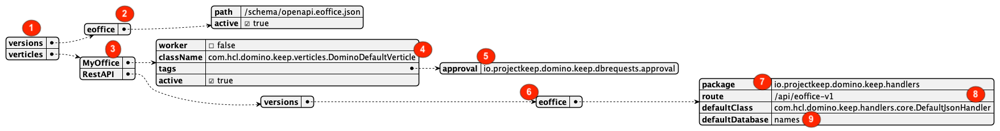
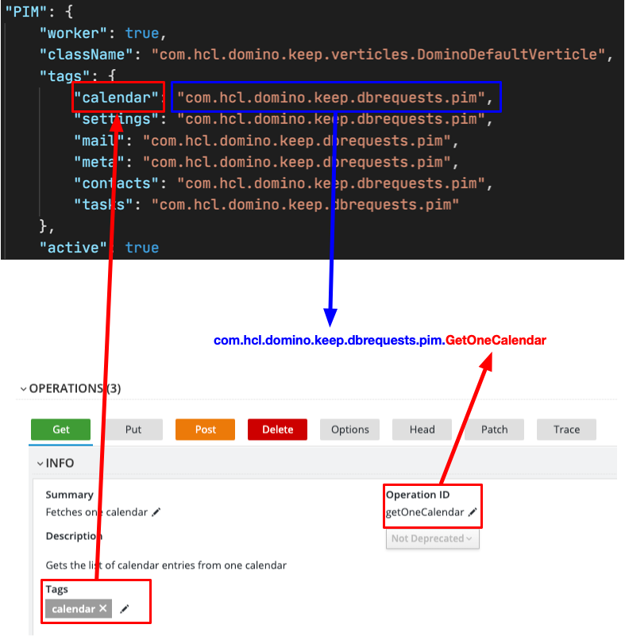

# The config.json configuration

DRAPI is driven by a [dynamic configuration](../../references/understandingconfig.md). To get your extension recognized you must provide the information what verticle will run your code and what classes implement your business logic. To do so a file `resources/config/config.json` is required:

```json
{
  "versions": {
    "eoffice": {
      "path": "/schema/openapi.eoffice.json",
      "active": true
    }
  },
  "verticles": {
    "MyOffice": {
      "worker": false,
      "className": "com.hcl.domino.keep.verticles.DominoDefaultVerticle",
      "tags": {
        "approval": "io.projectkeep.domino.keep.dbrequests.approval"
      },
      "active": true
    },
    "RestAPI": {
      "versions": {
        "eoffice": {
          "package": "io.projectkeep.domino.keep.handlers",
          "route": "/api/eoffice-v1",
          "defaultClass": "com.hcl.domino.keep.handlers.core.DefaultJsonHandler",
          "defaultDatabase": "names"
        }
      }
    }
  }
}
```

## Explanation



|Item|Description|
|:---|:---|
|1|`versions` contains all active API collections.|
|2|The name must match the middle part of your OpenAPI file (`openapi.eoffice.json`).|
|3|The entries in the verticle key determine how the HTTP side (fixed name `RestAPI`) and the database side (choose your own name) process your API.|
|4|Specifies the verticle to use on the database side. The default entry works for all regular API calls.|
|5|The tags entry is used to determine the package name for your implementation class (see below).|
|6|This must match item 2 and the middle part of your OpenAPI filename.|
|7|The package name for eventual HTTP side handlers, not relevant as long as you deal with JSON in/out.|
|8|The route needs to match your OpenAPI file and is the actual route used. If mismatched, interactive Swagger won't work.|
|9|Leave the default entries as is. Advanced use cases aren't subject of this tutorial.|

## Determine the class names for the business logic



The class name gets derived from the tag and the OperationID specified in the OpenAPI file. The tag gets mapped to a Java package name, while the OperationID forms the class name after the first letter gets captallized

!!! info "Next"

    [Implementing business logic](businesslogic.md)

## Let's connect

--8<-- "feedback.md"
