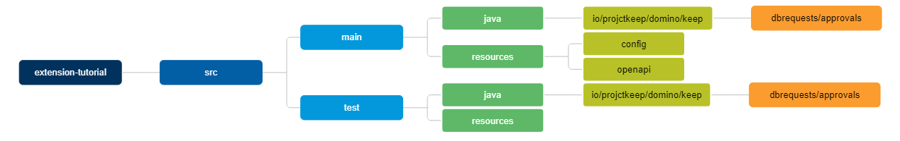

# Set up the Java Maven project

You will install the Domino REST API dependencies, configure a `pom.xml` and the Maven standard directory structure. The manual steps are outlined. Your IDE might have some automation that works faster.

## Prerequisites

- You need a matching JDK installed as Domino doesn't ship a JDK;
  - Java 8 for Domino 12
  - Java 17 for Domino 14
  - Java 21 for Domino 14.5
- Apache [Maven](https://maven.apache.org/) latest 3.9 edition
- Version control, we presume `Git` for this tutorial
- An IDE, but you could just use `vi` if you know how to exit it

Be careful when installing a JDK, it might have license requirements, such as the Oracle version, so stick with OpenJDK.

## Locate and install DRAPI dependencies

Maven at compile time relies on dependencies in the `~/.m2` directory structure, so you need to install DRAPI's jar files there manually since they're not published to Maven central and can't be automagically downloaded.

Locate the DRAPI installation directory and change into it. It typically is something like `/opt/hcl/keep` or `C:\Program files\HCL\restapi`. Make sure you see the following files:

- keep-core-\*.jar
- keep-extension-\*.jar
- keep-core-\*-javadoc.jar
- keep-extension-\*-javadoc.jar

where `*` stands for the internal build number, such as `1.38.0` for DRAPI v1.1.2.

!!! tip "You can use the installer"

    An easy way to get the files is to [run the installer](../installconfig/index.md) using the parameters `-a -n -s` to "install" the files to a temp directory. Make sure you have the matching installer for your Domino version.

Install the jars to `~/.m2` using this command (all OS):

```bash
mvn install:install-file -dfile=keep-core-1.38.0.jar
mvn install:install-file -dfile=keep-core-1.38.0-javadoc.jar
mvn install:install-file -dfile=keep-extension-1.38.0.jar
mvn install:install-file -dfile=keep-extension-1.38.0-javadoc.jar
```

## Create the directory structure

Keep all the code in `~/Code` (`%HOME%\Code` for Windows). Don't put files under version control in your `Documents` or `Desktop` folder. You only risk conflicts between version control and cloud sync (Google Drive, OneDrive, iCloud, etc.).

Decide on your organization, usually it's the reverse URL, so when your url is `acme.com`, you use `com.acme` as org, which is the entry to your packet hierarchy, for the purpose of this tutorial we will use `io.projectkeep`. Please **do not** use it for your actual code.

Decide on your organization. Usually, it's the reverse URL, so when your URL is `acme.com`, you use `com.acme` as org, which is the entry to your packet hierarchy. For the purpose of this tutorial, `io.projectkeep` is used. **Do not** use it for your actual code.



For macOS or Linux:

```bash
mkdir -p extension-tutorial/src/main/java/io/projectkeep/domino/keep/dbrequests/approvals
mkdir -p extension-tutorial/src/main/resources/config
mkdir -p extension-tutorial/src/main/resources/openapi
mkdir -p extension-tutorial/src/test/java/io/projectkeep/domino/keep/dbrequests/approvals
mkdir -p extension-tutorial/src/test/resources
```

For Windows:

```cmd
mkdir "extension-tutorial\src\main\java\io\projectkeep\domino\keep\dbrequests\approvals"
mkdir "extension-tutorial\src\main\resources\config"
mkdir "extension-tutorial\src\main\resources\openapi"
mkdir "extension-tutorial\src\test\java\io\projectkeep\domino\keep\dbrequests\approvals"
mkdir "extension-tutorial\src\test\resources"
```

The structure follows the Maven defaults and the package naming used in DRAPI.

## Add the `pom.xml`

In this tutorial, only the absolutely needed pieces are added. Depending on your corporate standards, you might add additional entries, listing developers, version control, check style, documentation creation, etc.

??? info "pom.xml"

    ```xml
    <?xml version="1.0" encoding="UTF-8"?>
    <project xmlns="http://maven.apache.org/POM/4.0.0"
        xmlns:xsi="http://www.w3.org/2001/XMLSchema-instance"
        xsi:schemaLocation="http://maven.apache.org/POM/4.0.0 http://maven.apache.org/xsd/maven-4.0.0.xsd">
        <modelVersion>4.0.0</modelVersion>
        <groupId>io.projectkeep.domino.keep</groupId>
        <artifactId>extension-tutorial</artifactId>
        <version>1.0.0-SNAPSHOT</version>
        <packaging>pom</packaging>
        <name>Keep API Extension Example</name>

        <properties>
        <!-- Adjust Domino & Java version to your environment -->
        <domino.version>14.0.0</domino.version>
        <java.version>17</java.version>
        <keep.version>1.38.0</keep.version> <!-- your Keep version -->
        <maven.compiler.plugin.version>3.13.0</maven.compiler.plugin.version>
        <maven.surefire.plugin.version>3.5.1</maven.surefire.plugin.version>
        <mockito.version>5.15.2</mockito.version>
        <restassured.version>5.5.0</restassured.version>
        <smallrye.jandex.version>3.2.3</smallrye.jandex.version>
        <!-- IMPORTANT: Encoding all UTF-8 -->
        <project.reporting.outputEncoding>UTF-8</project.reporting.outputEncoding>
        <project.build.sourceEncoding>UTF-8</project.build.sourceEncoding>
        </properties>

        <dependencies>
            <dependency>
                <groupId>com.hcl.domino.keep</groupId>
                <artifactId>keep-core</artifactId>
                <version>${keep.version}</version>
                <scope>provided</scope>
            </dependency>
            <dependency>
                <groupId>com.hcl.domino.keep</groupId>
                <artifactId>keep-extension</artifactId>
                <version>${keep.version}</version>
                <scope>provided</scope>
            </dependency>
        </dependencies>

        <build>
        <plugins>
                    <plugin>
                        <groupId>org.apache.maven.plugins</groupId>
                        <artifactId>maven-compiler-plugin</artifactId>
                        <version>${maven.compiler.plugin.version}</version>
                        <configuration>
                            <source>${java.version}</source>
                            <target>${java.version}</target>
                        </configuration>
                    </plugin>

                    <plugin>
                        <groupId>org.apache.maven.plugins</groupId>
                        <artifactId>maven-surefire-plugin</artifactId>
                        <version>${maven.surefire.plugin.version}</version>
                        <configuration>
                            <testFailureIgnore>false</testFailureIgnore>
                            <includes>
                                <include>**/*Test.java</include>
                                <include>**/*Tests.java</include>
                            </includes>
                            <forkNode
                                implementation="org.apache.maven.plugin.surefire.extensions.SurefireForkNodeFactory" />
                        </configuration>
                    </plugin>

                    <plugin>
                        <groupId>org.apache.maven.plugins</groupId>
                        <artifactId>maven-surefire-report-plugin</artifactId>
                        <version>${maven.surefire.plugin.version}</version>
                    </plugin>

                    <plugin>
                        <groupId>org.jetbrains.dokka</groupId>
                        <artifactId>dokka-maven-plugin</artifactId>
                        <version>2.0.0</version>
                        <executions>
                            <execution>
                                <id>site-gen</id>
                                <phase>pre-site</phase>
                                <goals>
                                    <goal>javadocJar</goal>
                                </goals>
                            </execution>
                            <execution>
                                <id>package</id>
                                <phase>prepare-package</phase>
                                <goals>
                                    <goal>javadocJar</goal>
                                </goals>
                            </execution>
                        </executions>
                    </plugin>

                    <plugin>
                        <groupId>org.cyclonedx</groupId>
                        <artifactId>cyclonedx-maven-plugin</artifactId>
                        <version>2.9.0</version>
                    </plugin>

                    <plugin>
                        <groupId>io.smallrye</groupId>
                        <artifactId>jandex-maven-plugin</artifactId>
                        <version>${smallrye.jandex.version}</version>
                        <executions>
                            <execution>
                                <id>make-index</id>
                                <goals>
                                    <goal>jandex</goal>
                                </goals>
                            </execution>
                        </executions>
                    </plugin>
            </plugins>
        </build>
    </project>
    ```

## Configure version control

Create the file `.gitignore` in the root of your project. Take inspiration from existing files [here](https://github.com/github/gitignore/blob/main/Maven.gitignore) or [here](https://github.com/HCL-TECH-SOFTWARE/domino-jnx/blob/develop/.gitignore). It's also **strongly** recommended to create the file [`.gitattributes`](https://github.com/HCL-TECH-SOFTWARE/domino-jnx/blob/develop/.gitattributes). Once created, you initialize and populate the repository:

```bash
git init
git add --all
git commit -m 'initial creation'
```

By frequently committing to your local Git, you work with the assurance that you can respawn in the event of any issues or errors.

## Next

Proceed to [OpenAPI specification](openapi.md).

<!--## Let's connect

"feedback.md"-->
