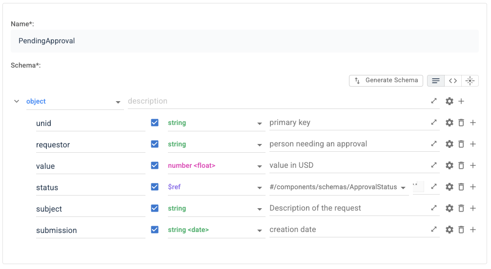
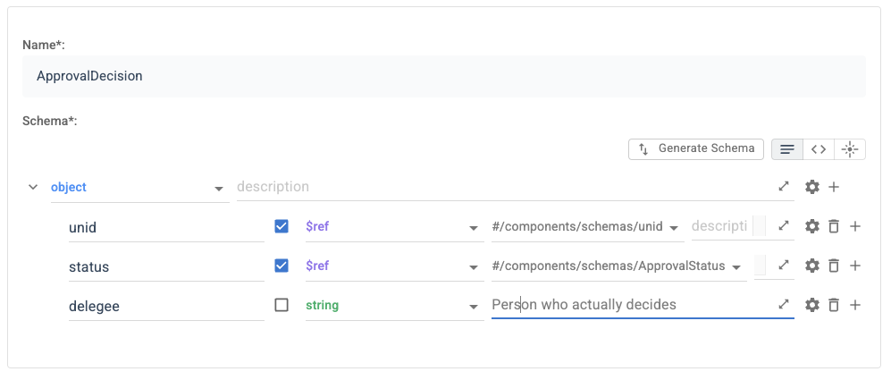
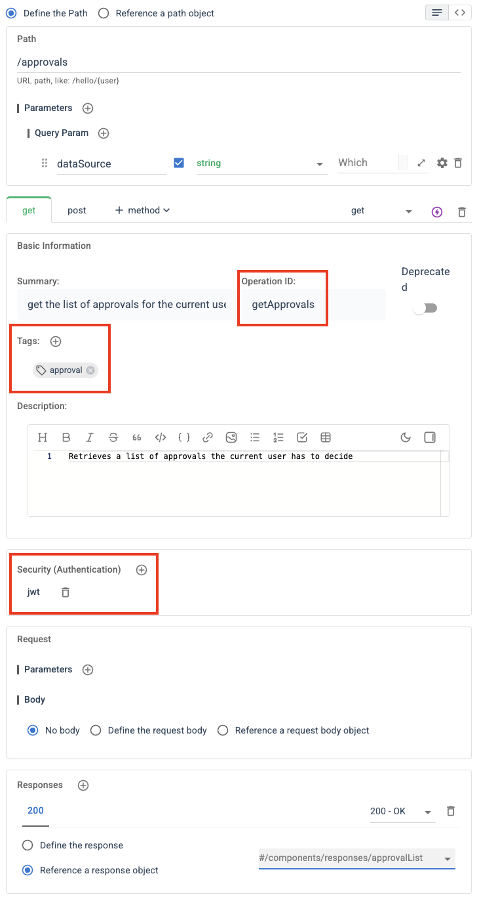
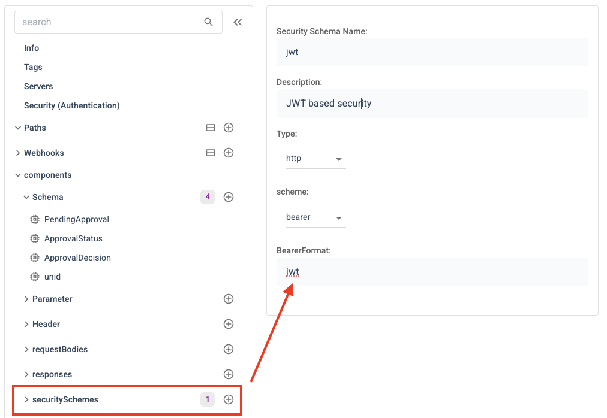
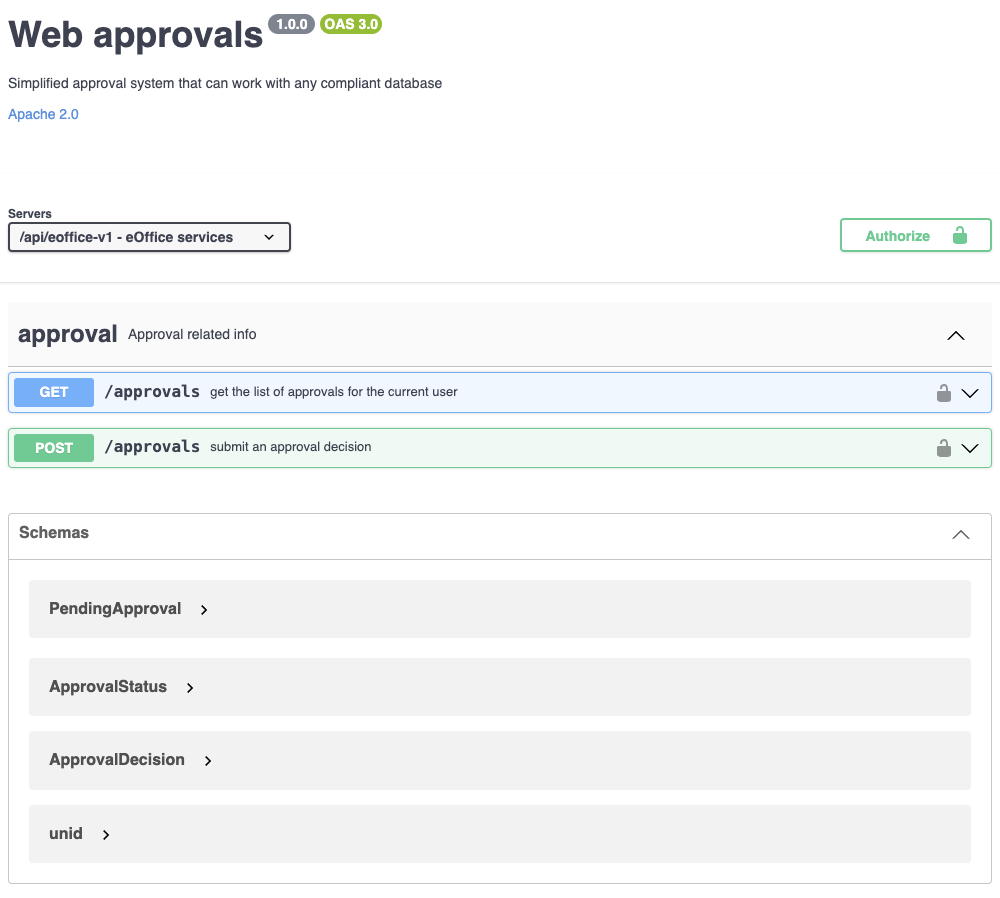

# OpenAPI 3.0.x specification

Second step is to create an OpenAPI 3.0.x specification. You can do that using notepad, but you want to use [available tooling](https://openapi.tools/#gui-editors). You could use the original [Swagger Editor](https://editor.swagger.io/), Redhat's [Apicurio](https://www.apicur.io/) (Apicurito will suffice in most cases) or (what the creator of this tutorial liked best): [APIGit](https://apigit.com/)

## The idea

The approval extension implements an approval system (simplified) that can work with any compliant database. A database is compliant when it has a view `pendingApprovalsByApprover` and a set of specified items in the document to be approved.

We implement a base function, to give you an idea. The example easily can be extended to add notification, communication with external systems etc.
You even could implement approvals for users who don't have write access to the document.

!!! warning "JSON and file naming"

    We support OpenApi's 3.0.x JSON format only.
    YAML or 3.1.x are not supported.

    The name of the file has to start with `openapi.` and end with `.json`

## End Points

Our extension shall allow to retrieve a list of pending approvals, approve or reject a request or delegate the decision.

### Data formats

In a typical development cycle we would start with the URLs and leave the data format unspecified a Json object for an initial iteration. In a later iteration the schema gets specified in detail and locked down.

!!! warning "Iterate your design"

    To be clear: OpenAPI does NOT require big upfront design, but allows for convenient ever refining iterations.

For the sake of this tutorial we present the final structure.

#### Pending approvals

The Schema looks like this, the URL (see below) will return an array of them. Note: It is good practise to compose the object definiions. In this example `status` is a referenced definition.

```json
{
  "type": "object",
  "properties": {
    "unid": {
      "type": "string",
      "description": "primary key",
      "readOnly": true,
      "minLength": 32,
      "maxLength": 32
    },
    "requestor": {
      "type": "string",
      "description": "person needing an approval",
      "readOnly": true
    },
    "value": {
      "type": "number",
      "description": "value in USD",
      "readOnly": true,
      "format": "float"
    },
    "status": {
      "$ref": "#/components/schemas/ApprovalStatus",
      "description": "Where are we"
    },
    "subject": {
      "type": "string",
      "description": "Description of the request",
      "readOnly": true
    },
    "submission": {
      "type": "string",
      "format": "date",
      "readOnly": true,
      "description": "creation date"
    }
  },
  "required": ["unid", "requestor", "value", "status", "subject", "submission"],
  "additionalProperties": false
}
```



#### Decision

A decision submission needs: the unid, the new status and in case of a delegation the delegee. We reuse the appoval status. In a production level application you probably would have more fields.

```json
{
  "type": "object",
  "properties": {
    "unid": {
      "$ref": "#/components/schemas/unid"
    },
    "status": {
      "$ref": "#/components/schemas/ApprovalStatus"
    },
    "delegee": {
      "type": "string",
      "description": "Person who actually decides"
    }
  },
  "required": ["unid", "status"],
  "additionalProperties": false
}
```



### URLs

For our tutorial project a single URL `/appovals` with `GET` for the list and `POST` for the decision is sufficient.



Important elements are:

- security: jwt
- tag
- OperationId

Tag and OperationId will form the package and class name [later on](configjson.md).

```json
{
  "get": {
    "summary": "get the list of approvals for the current user",
    "description": "Retrieves a list of approvals the current user has to decide",
    "operationId": "getApprovals",
    "tags": ["approval"],
    "parameters": [],
    "responses": {
      "200": {
        "$ref": "#/components/responses/approvalList"
      }
    },
    "security": [
      {
        "jwt": []
      }
    ]
  },
  "post": {
    "summary": "submit an approval decision",
    "description": "Submisssion of approval, rejection or delegation",
    "operationId": "submitDecision",
    "tags": ["approval"],
    "parameters": [],
    "responses": {
      "200": {
        "$ref": "#/components/responses/status"
      },
      "400": {
        "$ref": "#/components/responses/status"
      }
    },
    "security": [
      {
        "jwt": []
      }
    ],
    "requestBody": {
      "$ref": "#/components/requestBodies/DecissionBody"
    }
  },
  "parameters": [
    {
      "in": "query",
      "name": "dataSource",
      "description": "Which database to check",
      "schema": {
        "type": "string"
      },
      "required": true
    }
  ]
}
```

## Security

We need to specify what authentication is available. It needs to match the security spec from DRAPI. the only supported value is `jwt`.



## Extensions

There are a number of extensions [defined in DRAPI](../../references/openapidefinitions.md#custom-attributes), one can use to further refine the schema.

Our result looks like this:

.

You can reference the full file [here as `openapi.eoffice.json`](openapi.eoffice.json)

!!! info "Next"

    [Creating the config.json](configjson.md)

<!--## Let's connect

"feedback.md"-->
