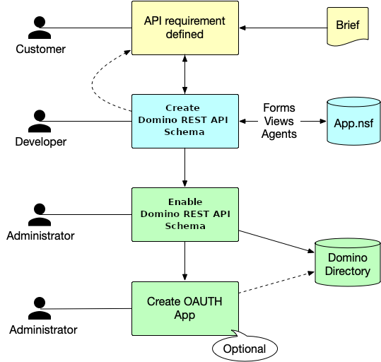

# Expose Domino database for REST API access

By default, no databases are available through the Domino REST API. You decide what Domino databases you want to expose. For those databases you want to expose, you can select specific design elements and define what actions are allowed to prevent potential misuse. Exposing Domino databases for REST API access is a shared activity between an [administrator and a developer](../../../references/usingdominorestapi/roles.md). As shown in the following diagram, the developer creates the schema, while the administrator enables the schema and creates the scope and OAuth application.

{: style="height:70%;width:70%"}

## About this task

The procedure guides you in creating the components that expose the Domino database to enable external applications to securely access Domino applications, their data, and design elements.

## Log in to Admin UI

The **Admin UI** provides an easy-to-use interface for creating and managing schemas, scopes, and OAuth applications for Domino applications to be accessible via Domino REST API.

1. Using a web browser, go to `http://serverhostname:8880/admin/ui`.

    wherein: `serverhostname` is your Domino server's hostname.

2. On the login page, enter the administrator username and password, and then click **LOG IN WITH PASSWORD**.

!!! tip

    For more information on logging in to the Admin UI, see the [other log in options](../../../references/usingwebui/index.md#log-in-options).

## Create a schema

The schema is created in the Domino database that you want to expose. The Domino database can have multiple schemas to provide different data sets or different levels of access to data.

!!! note

    The schema is created by a developer who has a Designer access level to the Domino database to be exposed.

### Add schema

1. Select **Database Management - REST API** from the home page or **Schemas** from the side navigation pane to access the **Schema Management** page.
2. On the **Schema Management** page, click **Add Schema**.

      

3. In the **Add New Schema** dialog, click **Create Schema**.

      {: style="height:80%;width:80%"}

4. In the **Create Schema** dialog:

      1. Select a database from the **Database** drop-down list.

         You can also enter the database name in the **Database** field to filter the list of available databases.

      2. Select an **Icon**.
      3. Enter a **Schema Name** and a **Schema Description**.
      4. Click **Save Schema**.

The new schema is available and visible on the **Schema Management** page. If no visible, make sure to click the **Only show schemas configured with scopes** toggle to the off position. 

!!! tip

    - You also have the option of importing an schema. For more information, see [Import a schema](../../../references/usingwebui/schemaui.md#import-a-schema).

### Activate a form

1. On the **Schema Management** page, click the schema you just created.
2. On the Database Forms tab, select the form that you want to activate, click the corresponding menu icon beside the form's status, and then select **Activate**.
3. Repeat the previous step for all the forms that you want to activate.

The activated form or forms now have an **Active** status.

!!! tip

    Click **Activate All** to activate all forms with default settings.

### Configure a form

1. On the **Database Forms** tab, click the pencil icon corresponding to the activated form that you want to configure.

    {: target="_blank" rel="noopener noreferrer"}

    The **Access Mode** page opens showing the `default` access mode.

    {: target="_blank" rel="noopener noreferrer"}

2. Under **Show fields from**, hover over a field item and click the **+** icon. This adds the field in the form. Repeat this for all the fields to be added.

    [{: style="height:50%;width:50%"}](../../../assets/images/addfield.png "Click to open in a new tab"){: target="_blank" rel="noopener noreferrer"}

    !!! tip

        - Click **Add All Fields** icon to add all the available fields to the form.
        - Click **Refresh List of Fields** icon to refresh the list of avaialble fields.
        - Use the **Search Field** search box to search for a field by field name.
        - Hover over the **Info** icon beside the field name to show the field property. The field can be *editable*, which means that the field has **Read/Write** access setting. The field can also be either *computed*, *computed when composed*, or *computed for display*, which means that the field has **Read Only** access setting.
        - Enter a custom field name in the **Add custom field** and click the **+** icon to add a custom field to the form.
        - Click **Delete Fields**, select the fields to remove, and then click **Remove** to remove the selected fields from the form.

3. Under **Field Setting**, you can set the **Field Name**, **Field Type**, and the read or write access of the field in the form.

    !!! tip

        - Click the **Multi-Value** toggle to the on position to specify a **Field Group**. The **Multi-Value** toggle isn't clickable to the off position if you specified a field group.
        - Click the **Required** toggle to the on position to specify that the field is a required field. When set to the on position, the word *Required* is added below the name of the field in the added field list.

    !!!note "Encryption feature"

        The encryption feature is available starting from the Domino REST API v1.1.0 release. Make sure to [set up Domino REST API for encryption, decryption, and signing](../../../howto/production/signencrypt.md) before executing the following steps for encryption and signing.

        Click the **Encrypt** toggle to the on position to enable encryption. For more information on encryption and signing, see [Using encryption, decryption, and signing during development](../../../references/usingdominorestapi/encryptsign.md).

4. Under **Mode Settings**:

      1. Click the pencil icon corresponding to a mode formula. A dialog opens.

          The following image shows the opened **Formula for Delete Access** dialog.  

          {: target="_blank" rel="noopener noreferrer"}

      2. In the text field in the dialog, edit the `@True` or `@False` entry and click **Save** to close the dialog.

    !!! note "Signing feature"

        The signing feature is available starting from the Domino REST API v1.1.0 release. Make sure to [set up Domino REST API for encryption, decryption, and signing](../../../howto/production/signencrypt.md) before executing the following steps for encryption and signing.

        Click the **Sign Document** toggle to the on position to enable this feature. For more information on encryption and signing, see [Using encryption, decryption, and signing during development](../../../references/usingdominorestapi/encryptsign.md).

5. (**Optional**) Under **Validation Rules**:

      1. Click **Add Rule** if you want to add a validation rule to validate the value of a field. The **Add Rule** dialog opens.
      2. Enter the validation formula in the **Formula** field and the error message in the **Error Message** field.
      3. Click **Add**.

6. Click **Save**.

!!! note

    - Form modes specify what data can be read or written to documents using the form name in their form item. The Admin UI lists four modes that provide a special purpose. They are default, dql, odata and raw. Depending on the use case, the developer may define more than the default mode.
    - For more information on configuring a form, see [Change form configuration](../../../references/usingwebui/schemaui.md#change-form-configuration).

### Activate a view

1. Click the name of your schema from the breadcrumb navigation menu to go back to the Schema Management page. 
2. Select **Database Views** from the menu bar. This lists all the views for the selected schema.

      

3. Select the view that you want to activate, and then click the corresponding **Active** option under **Status**.
4. Repeat the previous step for all the views that you want to activate.

### Activate an agent

1. Select **Database Agents** from the menu bar. This lists all the Agents for the selected database.

      

2. Select the agent you want to activate, and then click the corresponding **Active** option under **Status**.
3. Repeat the previous step for all the agents that you want to activate.

## Create a scope

The scope configuration is stored in the KeepConfig.nsf database. This separation of scope and schema means multiple scopes can link to a single schema. You use the scope name when performing all CRUD operations.

1. Select **Database Management - Activation** from the home page or **Scopes** from the side navigation pane to access the **Scope Management** page.
2. On the **Scope Management** page, click **Add Scope**.

      

3. Under **Available Schema**, select the schema that you created.
4. Under **Add New Scope**, fill in the form and click **Add**.

    - For the **Server** field, enter the name of the server the scope is available on, or leave it blank for the current server. The value of the entered name must be either the server's hierarchical name or in canonical format. See the following examples for reference:

        - MyServer/MyOrg
        - CN=MyServer/O=MyOrg

        --8<-- "scopenote.md"

    - For the **Maximum Access Level**, the default is **Editor**. You can set it to another value to set the scope's maximum access anyone using the scope has.

!!! note

    The **Maximum Access Level** prevents an app that has inherited a user's access rights when the user grants the app access from unauthorized altering of schemas or access control lists.  To know more about what each access level allows and to whom the access level is assigned, see [Access levels in the ACL](https://help.hcltechsw.com/domino/14.0.0/admin/conf_accesslevelsintheacl_c.html).

## Create an OAuth application

!!! note

    This step is optional and is only applicable when you use Domino REST API as your identity provider.

You can create one or more OAuth applications that can access one or more of the defined scopes.

### Add application

1. Select **Application Management - OAUTH** from the home page or **Applications** from the side navigation pane to access the **Application Management** page.
2. On the **Application Management** page, click **Add Application**.
3. Under **Add New Application**, fill in the form and click **Add**.

      

      The new application is now shown on the **Application Management** page.

!!! note

    - When adding a scope, select the scope from the **Scope** drop-down list and click the **Add Scope** icon.
    - The callback URL will be provided by the external application that will be accessing Domino through Domino REST API, which is the redirect after OAuth authentication. 
    - **When your app accesses endpoints that run write operations in the `/setup-v1/` URL path, make sure to add the `$SETUP` scope aside from the `$DATA` scope** to enhance access control in relation to the app inheriting a user's access rights when the user grants app access.
    - Select the **use PKCE** checkbox if you want to use PKCE or Proof Key for Code Exchange, an extension to the authorization code flow to prevent cross-site request forgery and authorization code injection attacks. For more information about how PKCE works and how to implement PKCE, see [Authorization Code Flow with Proof Key for Code Exchange (PKCE)](https://auth0.com/docs/get-started/authentication-and-authorization-flow/authorization-code-flow-with-pkce "Opens a new tab"){: target="_blank" rel="noopener noreferrer"}&nbsp;{: style="height:15px;width:15px"}.

### Generate an app secret

!!! note

    This only applies to applications that use app secret as authentication method. This is not needed if you use PKCE as the authentication method. For more information, see [Application Management](../../../references/usingwebui/appui.md).

Click the **Click to Generate Secret** text corresponding to the new OAuth application to generate the **App Secret**.

You will supply the **App ID** and **App Secret** to the external application that will be accessing the related Domino database through the Domino REST API.

Make sure to take note of the **App Secret**. Once you switch away from the **App Management** page, the **App Secret** will be salted and hashed, and then saved. It can't be transformed back. If you forget it, you need to generate a new one.
