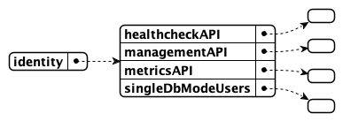
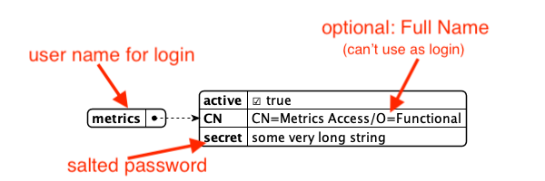

# Set up functional accounts

You need functional accounts to enable access to the following endpoints that aren't associated with regular user IDs:

- Management console (Port 8889)
- Metrics endpoint (Port 8890)
- Health check (Port 8886)

## About this task

The procedure guides you in setting up a functional account.

## Create user and password to **initially** access the Management console

You need access to the **Management console** to use its utility function to salt and encrypt passwords.

1. Create a `tempmanagement.json` file in your `[NotesData]/keepconfig.d` directory with the following content:

  ```json
  {
    "identity": {
      "managementAPI": {
        "Doctor Notes": {
          "active": true,
          "secret": "E4B321EBA91B7F92D9BF5EAFA5322824FEC2287B8A6C133D7C31EFB706A2BA30:1A57478185E7AF3A98F01ECA08F0BA881DBC88BEC60AE8C6F1B1CC5CC55C11A20F676E082BF2D28BB96DB5A8CFB091C767C035B380DB4CBC7D1001EA8BE01663"
        }
      }
    }
  }
  ```

  This creates the user *Doctor Notes* with the password set to *password* to access the Management console.

2. Restart Domino REST API.

!!! tip

    **Don't leave default passwords in your system**. When done with generating new salted passwords, securely back-up `tempmanagement.json` to prevent unauthorized access, and then restart Domino REST API.

## Generate salted password

This procedure enables you to generate a salted and encrypted password for use in your functional account.

1. Log in to the **Management console** (Port 8889) using username `Doctor Notes` with password `password`.
2. On the **Management console**, enter the password you want to set in the **Salt this** text field.
3. Click **Salt**. The salted password is shown.
4. Save the password and the salted password.

You use the password when logging in to the endpoints, while you use the salted password to set up the functional account to access the endpoints.

## Create functional accounts

1. Create a JSON file in the `[NotesData]/keepconfig.d` directory with the following JSON structure:

    

    ```json
    {
      "identity": {
        "healthcheckAPI": {},
        "managementAPI": {},
        "metricsAPI": {},
        "singleDbModeUsers": {}
      }
    }
    ```

2. In each of the sections, specify a user object in the same way:

    

    **Example 1**

    ```json
    {
      "metrics": {
        "active": true,
        "secret": "13549ED65AD8760294B9DC898C44F8ABEED399ABB1CA7DC51E8CCFF461D56D13:32BDC8A5DF60FCE424299543DFFF408F500DB1B1EEC4FAB848AA0ED794F5D89AA65A5449EC36BF9CBF53980E4B7DF2B3A3581186E409F5B69BC0C16E51237CC8"
      }
    }
    ```

    **Example 2**

    ```json
    {
      "John Doe": {
        "active": true,
        "CN": "CN=John Doe/O=Mauraders",
        "secret": "E4B321EBA91B7F92D9BF5EAFA5322824FEC2287B8A6C133D7C31EFB706A2BA30:1A57478185E7AF3A98F01ECA08F0BA881DBC88BEC60AE8C6F1B1CC5CC55C11A20F676E082BF2D28BB96DB5A8CFB091C767C035B380DB4CBC7D1001EA8BE01663"
      }
    }
    ```

    | Key | Purpose |
    | :--- | :--- |
    | JSON key | UserId for authentication, case-sensitive, no variations. In the examples, `metrics` and `John Doe` are JSON keys. You can use other values for the JSON key. |
    | active | true or false, set to false to temporarily disable an account. |
    | CN | **Optional**: Common name in X500 format. When defined, the name is for display only. You still need to log in using the JSON key as your username. |
    | secret | The salted and encrypted password you [generated](setupfunctionalaccount.md#generate-salted-password).|

3. Restart Domino REST API on all servers with this new configuration.

## Expected output

Using the examples provided, your `tempmanagement.json` file might look like the following example JSON structure:

    ```json
    {
      "identity": {
        "healthcheckAPI": {
          "John Doe": {
            "active": true,
            "CN": "CN=John Doe/O=Mauraders",
            "secret": "E4B321EBA91B7F92D9BF5EAFA5322824FEC2287B8A6C133D7C31EFB706A2BA30:1A57478185E7AF3A98F01ECA08F0BA881DBC88BEC60AE8C6F1B1CC5CC55C11A20F676E082BF2D28BB96DB5A8CFB091C767C035B380DB4CBC7D1001EA8BE01663"
      }
        },
        "managementAPI": {
          "Doctor Notes": {
            "active": true,
            "secret": "E4B321EBA91B7F92D9BF5EAFA5322824FEC2287B8A6C133D7C31EFB706A2BA30:1A57478185E7AF3A98F01ECA08F0BA881DBC88BEC60AE8C6F1B1CC5CC55C11A20F676E082BF2D28BB96DB5A8CFB091C767C035B380DB4CBC7D1001EA8BE01663"
      }
        },
        "metricsAPI": {
          "metrics": {
            "active": true,
            "secret": "13549ED65AD8760294B9DC898C44F8ABEED399ABB1CA7DC51E8CCFF461D56D13:32BDC8A5DF60FCE424299543DFFF408F500DB1B1EEC4FAB848AA0ED794F5D89AA65A5449EC36BF9CBF53980E4B7DF2B3A3581186E409F5B69BC0C16E51237CC8"
      }
        }
      }
    }
    ```

Based on the example, you can log in to the **Management console** (Port 8889) using the username *Doctor Notes*, to the Metrics endpoint (Port8890) using the username *metrics*, and to the Health check (Port 8886) using the username *John Doe*. You have to use the password corresponding to the salted password you configured for each username.

For more information, see [Functional accounts](../../../references/functionalUsers.md).

## Next step

Proceed to [Configure JWT](jwtconfig.md).


<!--
# Set up a functional account

You need functional accounts to enable access to the following endpoints that aren't associated with regular user IDs:

- Management console (Port 8889)
- Metrics endpoint (Port 8890)
- Health check (Port 8886)

## About this task

The procedure guides you in setting up a functional account. 

## Procedure

###	Create user and password to **initially** access the Management console

1. Create a `tempmanagement.json` file in your `[NotesData]/keepconfig.d` directory.
2. Copy the following content in the `tempmanagement.json` file:

```json
{
  "identity": {
    "managementAPI": {
      "Doctor Notes": {
        "active": true,
        "secret": "E4B321EBA91B7F92D9BF5EAFA5322824FEC2287B8A6C133D7C31EFB706A2BA30:1A57478185E7AF3A98F01ECA08F0BA881DBC88BEC60AE8C6F1B1CC5CC55C11A20F676E082BF2D28BB96DB5A8CFB091C767C035B380DB4CBC7D1001EA8BE01663"
      }
    }
  }
}
```

This creates the user `Doctor Notes` with the password `password` to access the **Management console**.

### Generate user password 

1. Log in to the **Management console** (Port 8889) using username `Doctor Notes` with password `password`. 
2. On the **Management console**, enter the password you want to set in the **Salt this** text field.
3. Click **Salt**. The salted password is shown. 
4. Save the password and the salted password.

You use the password when logging in to the endpoints, while you use the salted password to set up the functional account to access the endpoints. 
 
###	Create a functional account 

1. Create a `functionalUsers.json` file in the `[NotesData]/keepconfig.d` directory. 
2. Add the following JSON structure:

    

    ```json
    {
      "identity": {
        "healthcheckAPI": {},
        "managementAPI": {},
        "metricsAPI": {},
        "singleDbModeUsers": {}
      }
    }
    ```

3. In each of the sections, specify a user object in the same way:

    

    ```json
    {
      "metrics": {
        "active": true,
        "secret": "13549ED65AD8760294B9DC898C44F8ABEED399ABB1CA7DC51E8CCFF461D56D13:32BDC8A5DF60FCE424299543DFFF408F500DB1B1EEC4FAB848AA0ED794F5D89AA65A5449EC36BF9CBF53980E4B7DF2B3A3581186E409F5B69BC0C16E51237CC8"
      }
    }
    ```

    !!!note
        The text you enter for `secret` is the salted password you [generated](setupfunctionalaccount.md#generate-user-password).

4. Restart Domino REST API on all servers with this new configuration.

## Expected output

Based on the example in the procedure, you can now log in to the endpoints using `metrics` as your username and the password [you set](setupfunctionalaccount.md#generate-user-password) corresponding to the salted password. 

For more information, see [Functional accounts](../../references/functionalUsers.md).

-->