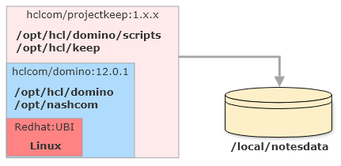

<!--# Docker-->

# Run Domino REST API with a Docker image

The Domino REST API Docker image is built **on top of an HCL Domino Docker image**, inspired by [the open source templates](https://github.com/HCL-TECH-SOFTWARE/domino-container).
All configuration options found there can be applied to the Domino REST API Docker image. You will need to decide if you want to run a standalone server or an additional server in an existing Domino domain.

<!-- prettier-ignore -->
!!! tip
    The Domino REST API Docker image **contains** a Domino server. You don't need a separate Domino installation. The image is completely self contained. Domino REST API is a Domino service, using the network free C API. So there is no scenario where an "only Domino REST API" container would work.

## Prerequisites

Running Domino REST API with a Docker image requires the following:

- **[Docker Desktop](https://docs.docker.com/get-docker/)** 

    A Docker installation, both **Docker** (for servers) or **Docker Desktop** are suitable. Download and install **Docker Desktop** for your environment (Linux, Windows or macOS).

    <!-- prettier-ignore -->
    !!!tip "Docker Desktop License"
        Docker desktop [recently](https://www.theregister.com/2021/08/31/docker_desktop_no_longer_free/) became subject to a [Docker subscription](https://www.docker.com/pricing), make sure you are compliant or use the command line.

- **[Docker Compose](https://docs.docker.com/compose/install/)** 

    When you install a Docker Desktop version (Windows, macOS), Docker compose is already included. For servers, it's an [additional install](https://docs.docker.com/compose/install/).

- **Domino REST API Docker image**. 

    Download the image as an archive file from [HCL Software License and Download Portal](https://hclsoftware.flexnetoperations.com/ "Opens a new tab"){: target="_blank" rel="noopener noreferrer"}&nbsp;{: style="height:15px;width:15px"} or [My HCLSoftware Portal](https://my.hcltechsw.com/ "Opens a new tab"){: target="_blank" rel="noopener noreferrer"}&nbsp;{: style="height:15px;width:15px"}. For more information, see [Download Domino REST API](index.md#download-domino-rest-api).

    !!! warning "Important"

        - If using a Docker image from [HCL Container Repository (Harbor)](https://hclcr.io/ "Opens a new tab"){: target="_blank" rel="noopener noreferrer"}&nbsp;{: style="height:15px;width:15px"}, take note of the image name of the latest Docker image version from Harbor indicated in [What's New](../../references/whatsnew/index.md) of a release, update the CONTAINER_IMAGE variable in the [.env file](#update-env-file), and then [execute docker-compose](#run-domino-rest-api).

        - If prompted for access to HCL Container Repository (Harbor), [obtain your HCL Container Repository username and password](../../howto/install/obtainauthenticationtoken.md), and then sign-in using `docker login hclcr.io` command and the obtained credentials.  

- **Docker compose file** 

    Download the file from [downloadable resources](../../references/downloads.md). Select the matching one for either a standalone primary or an additional server.

- **`.env` file**. 

    Download the `sample.env` from [downloadable resources](../../references/downloads.md). **Rename the file to `.env`**<!--, and **update** the `.env` file with your values-->.

- A valid **Domino server id**, when you want to run an additional server in your existing domain.

### Persistent volume

A Domino server uses one persistent volume to store its data. This volume also stores log files and the server’s ID file. When you remove the container, that volume remains and is reused when you start a new container instance.



<!-- prettier-ignore -->
!!!note
    When you want to run multiple servers, create separate volumes for each. **DO NOT** share volumes between running instances.

## Store the following files in a folder

- **server id** 
    
    Make sure that your server id file is named `server.id`.

- **docker-compose.yml**. 

    Rename the compose file you downloaded from [resources](../../references/downloads.md) to `docker-compose.yml`.

    !!!note
        You can configure multiple Domino servers in a single compose file. For details, check the [Docker compose](https://docs.docker.com/compose/) documentation. With Domino REST API in mind, each server needs its own volume.

- **.env** 

    Edit the `.env` file from [resources](../../references/downloads.md) to update your values. For more information, see [Update .env file](#update-env-file).


## Load Docker image

**For docker image from HCL Software License and Download Portal or My HCLSoftware Portal**

Load the docker image that you've downloaded from [prerequisites](#prerequisites). Make sure you [extract the tar.gz file](https://linuxize.com/post/how-to-extract-unzip-tar-gz-file/ "Opens a new tab"){: target="_blank" rel="noopener noreferrer"}&nbsp;{: style="height:15px;width:15px"} first. 

```bash
docker load -i [name_of_tar_file].tar
```

After loading the image, note the image name that was output. You need the image name to update the `CONTAINER_IMAGE` variable in the `.env` file.

!!! example "Example loaded image name"

    - From earlier releases: `docker.qs.hcllabs.net/hclcom/projectkeep-r12:1.10.0`
    - Starting v1.0.7 release: `domino-rest-api:1.0.7`

**For docker image from HCL Container Repository (Harbor)**

Take note of the image name of the latest docker image version for docker compose .env file from Harbor indicated in [What's New](../../references/whatsnew/index.md) of a release version. You need the image name to update the `CONTAINER_IMAGE` variable in the `.env` file.

!!! example "Example image name"

    `hclcr.io/domino/restapi:1.0.6`

## Update .env file

Depending on the compose file you choose, a different set of variables needs to be replaced. If a variable isn't in the compose file, you don't need it. We keep the variable names in sync with [One-touch Domino setup](https://help.hcl-software.com/domino/14.0.0/admin/inst_onetouch.html), thus in the compose file you will find gems like `SERVERSETUP_SERVER_NAME: "${SERVERSETUP_SERVER_NAME}"`. This makes naming of variables consistent.

!!!tip
    Refer also to the official [List of One-touch environment variables](https://help.hcltechsw.com/domino/14.0.0/admin/inst_onetouch_preparing_sysenv.html) for reference.

**To update the variables in the compose file, update the variables in the `.env` file with your values**. Replace all values after the equal `=` sign. Refer to the table below for guidance on the variables, their example values, and additional information. 

| Variable | Example | Remarks |
| :---- | :---- | :---- |
| CONTAINER_HOSTNAME | domino.acme.com | Pro tip: use something.local for local testing|
| CONTAINER_IMAGE | docker.qs.hcllabs.net/hclcom/projectkeep-r12:1.10.0 (example name for docker image from HCL Software License and Download Portal or My HCLSoftware Portal from earlier release)</br></br>domino-rest-api:1.0.7 (example name for docker image from HCL Software License and Download Portal or My HCLSoftware Portal starting v1.0.7 release)</br></br>hclcr.io/domino/restapi:1.0.6 (example name for docker image from Harbor)| <!--**Check** carefully for the current image name! `:latest` most likely need to be replaced.--> For docker image downloaded from HCL Software License and Download Portal or My HCLSoftware Portal, update based on the name of the loaded image, such as the example shown above, or use `docker images ls` to see the exact image name. <br><br>For docker image downloaded from Harbor, update based on the image name of the latest docker image version for docker compose .env file from Harbor indicated in [What's New](../../references/whatsnew/index.md) of a release.|
| CONTAINER_NAME | domino-keep-test02 | |
| CONTAINER_VOLUMES | domino_keep_notesdata | no spaces or special characters |
| SERVERSETUP_ADMIN_CN | Peter Parker | |
| SERVERSETUP_ADMIN_FIRSTNAME | Paul | |
| SERVERSETUP_ADMIN_LASTNAME | Herbert| |
| SERVERSETUP_ADMIN_PASSWORD | domin4ever| |
| SERVERSETUP_EXISTINGSERVER_CN | domino01 | YOUR EXISTING SERVER |
| SERVERSETUP_EXISTINGSERVER_HOSTNAMEORIP | 10.45.10.3 | MUST BE REACHABLE, can use DNS too |
| SERVERSETUP_NETWORK_HOSTNAME  | keep01.domino.acme.com | MUST RESOLVE |
| SERVERSETUP_ORG_CERTIFIERPASSWORD | supersecret | |
| SERVERSETUP_ORG_ORGNAME | Stark Industries | YOUR EXISTING ORG |
| SERVERSETUP_SERVER_DOMAINNAME | MarvelPhase4 | YOUR EXISTING NOTES DOMAIN |
| SERVERSETUP_SERVER_NAME | keep-server-01 |
| SERVERSETUP_SERVER_SERVERTASKS | replica, router, update, amgr, adminp, http, keep | Refer to the [Domino REST API task](../../references/usingdominorestapi/restapitask.md) page.|

## Run Domino REST API

Start Domino REST API using `docker-compose` on all supported platforms by running the following command:

```bash
docker-compose up
```

<!-- prettier-ignore -->
!!! note
    - Start in the directory where the files `server.id` and `docker-compose.yml` are located.
    - The setup can take a few minutes, depending on your hardware and the network speed to your primary server.
    
    - If prompted for access credentials to HCL Container Repository (Harbor), see [Obtain authentication token from HCL Container Repository](../../howto/install/obtainauthenticationtoken.md).

<!-- prettier-ignore -->
!!! tip
    **When you don't have DNS setup**, amend your `hosts` file for name resolution:

    - `/etc/hosts` on Linux or macOS
    - `C:\Windows\System32\drivers\etc\hosts` on Windows

- You can then use Docker desktop to start/stop the container.
- Use `docker-compose up -d` to run docker in the background.
- **Don't run two Domino REST API containers sharing the same volume at the same time**, alternate (such as debug/non-debug) or with 2 different volumes is OK.

## Validation

To validate that an instance is successfully running on a container:

- A Docker container should be created and running on your Docker machine. To check that the container is up, run the following command on a terminal:

```bash
docker ps
```

- The container should be accessible via

```bash
docker exec -it $containername /bin/bash
```

- Domino should be accessible on `http://$host:80` (might need configuration).
- Domino REST API should be accessible on `http://$host:8880`.
- Domino REST API Management should be accessible on `http://$host:8889`.
- Metrics should be accessible on `http://$host:8890/metrics`.

## Alternate Docker configuration

When you run your Domino servers on Linux, you probably use the [Nashcom startup script](https://www.nashcom.de/nshweb/pages/startscript.htm) for Domino.
On this foundation, the GitHub.com hosted [Domino Docker](https://github.com/HCL-TECH-SOFTWARE/domino-container) project offers management scripts that allows easy management of your Docker container using a command `domino_container`.

Installation steps are as follows:

1. Clone the [domino-docker](https://github.com/HCL-TECH-SOFTWARE/domino-container) repository: `git clone https://github.com/HCL-TECH-SOFTWARE/domino-container`

2. Change into the installation directory: `cd start_script`
3. Run the installer: `./install_domino_container` 

    !!!note
        You might need `sudo` to run the installer.

Now you have the command `domino_container` at your disposal:

- Use `domino_container cfg` to set your configuration.
- Use `domino_container env` for the environment values.
- Start Domino and Domino REST API using `domino_container start`.
- Learn more about the scripts using `domino_container help`.
