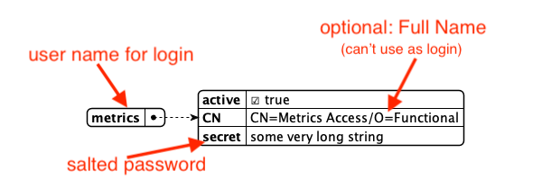

# Set up a functional account 

You need functional accounts to enable access to the following endpoints that aren't associated with regular user IDs:

- Management console (Port 8889)
- Metrics endpoint (Port 8890)
- Health check (Port 8886)

## About this task

The procedure guides you in setting up a functional account. 

## Procedure

###	Create user and password to **initially** access the Management console

1. Create a `tempmanagement.json` file in your `[NotesData]/keepconfig.d` directory.
2. Copy the following content in the `tempmanagement.json` file:

```json
{
  "identity": {
    "managementAPI": {
      "Doctor Notes": {
        "active": true,
        "secret": "E4B321EBA91B7F92D9BF5EAFA5322824FEC2287B8A6C133D7C31EFB706A2BA30:1A57478185E7AF3A98F01ECA08F0BA881DBC88BEC60AE8C6F1B1CC5CC55C11A20F676E082BF2D28BB96DB5A8CFB091C767C035B380DB4CBC7D1001EA8BE01663"
      }
    }
  }
}
```

This creates the user `Doctor Notes` with the password `password` to access the **Management console**.

### Generate user password 

1. Log in to the **Management console** (Port 8889) using username `Doctor Notes` with password `password`. 
2. On the **Management console**, enter the password you want to set in the **Salt this** text field.
3. Click **Salt**. The salted password is shown. 
4. Save the password and the salted password.

You use the password when logging in to the endpoints, while you use the salted password to set up the functional account to access the endpoints. 
 
###	Create a functional account 

1. Create a `functionalUsers.json` file in the `[NotesData]/keepconfig.d` directory. 
2. Add the following JSON structure:

    

    ```json
    {
      "identity": {
        "healthcheckAPI": {},
        "managementAPI": {},
        "metricsAPI": {},
        "singleDbModeUsers": {}
      }
    }
    ```

3. In each of the sections, specify a user object in the same way:

    

    ```json
    {
      "metrics": {
        "active": true,
        "secret": "13549ED65AD8760294B9DC898C44F8ABEED399ABB1CA7DC51E8CCFF461D56D13:32BDC8A5DF60FCE424299543DFFF408F500DB1B1EEC4FAB848AA0ED794F5D89AA65A5449EC36BF9CBF53980E4B7DF2B3A3581186E409F5B69BC0C16E51237CC8"
      }
    }
    ```

    !!!note
        The text you enter for `secret` is the salted password you [generated](setupfunctionalaccount.md#generate-user-password).

## Expected output

Based on the example in the procedure, you can now log in to the endpoints using `metrics` as your username and the password [you set](setupfunctionalaccount.md#generate-user-password) corresponding to the salted password. 

For more information, see [Functional accounts](../../references/functionalUsers.md).