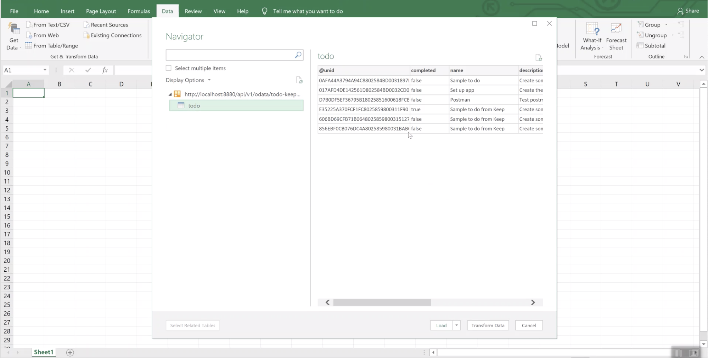
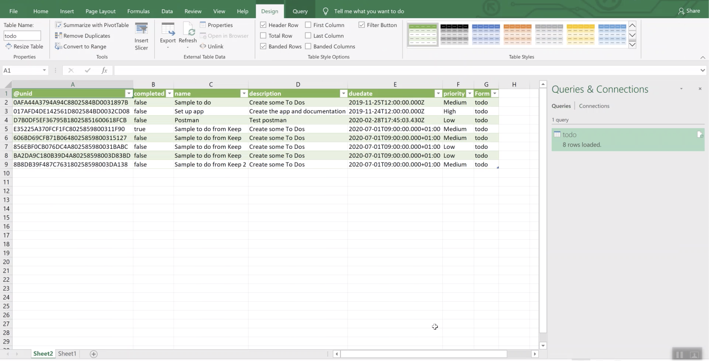

# How to export data from Notes database to OData format

The Domino REST API allows exporting of data from Notes databases to [OData](https://www.odata.org) format, which can then be read by applications like Excel for Windows, Salesforce, SAP and Business Intelligence.
This means that the data in a Notes database can be displayed in something as simple as Excel with just a few clicks.

!!! note OData for Excel is only available in the Windows version of Excel

1. Open Microsoft Excel and create a Blank Workbook.
2. Select **Data** &rarr; **Get Data** &rarr; **From Other Sources** &rarr; **From ODataFeed**.

   

3. Point it to an application on the Domino server. In the example, it's pointed to a To-do application.

   

4. Click **OK**.

   

5. Select **Load** to display the Notes data in Excel. The structure of the Notes database is understood.

   

The Excel sheet is a live document. Any update to the Notes database is seen when you click **Refresh**.

At the moment, only basic authentication is supported.
