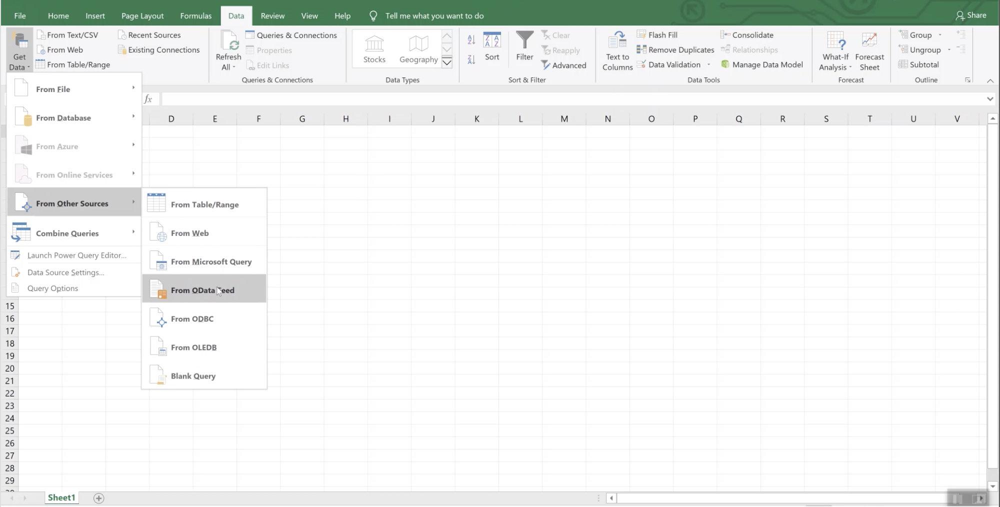
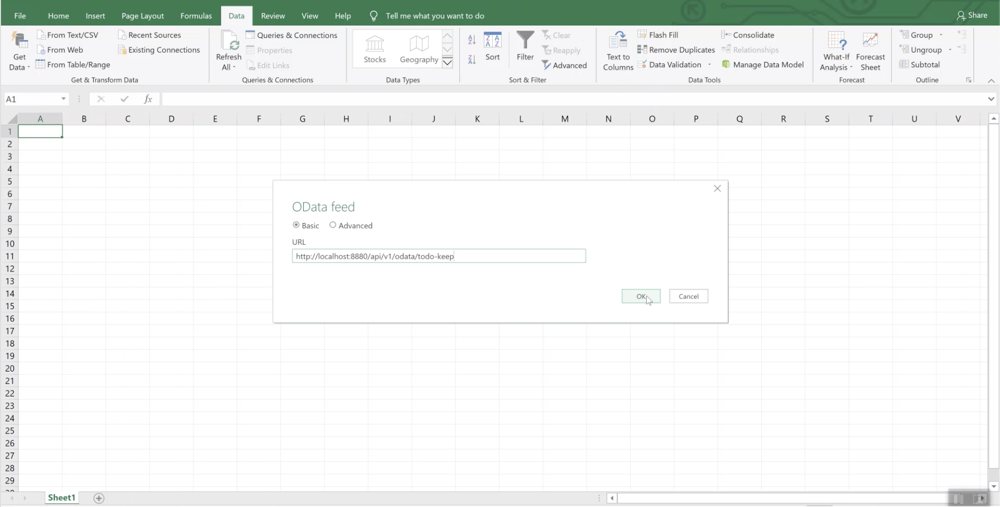
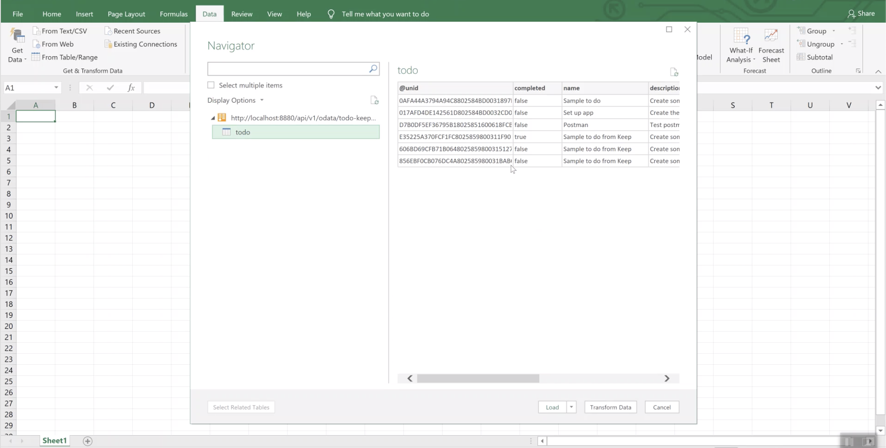
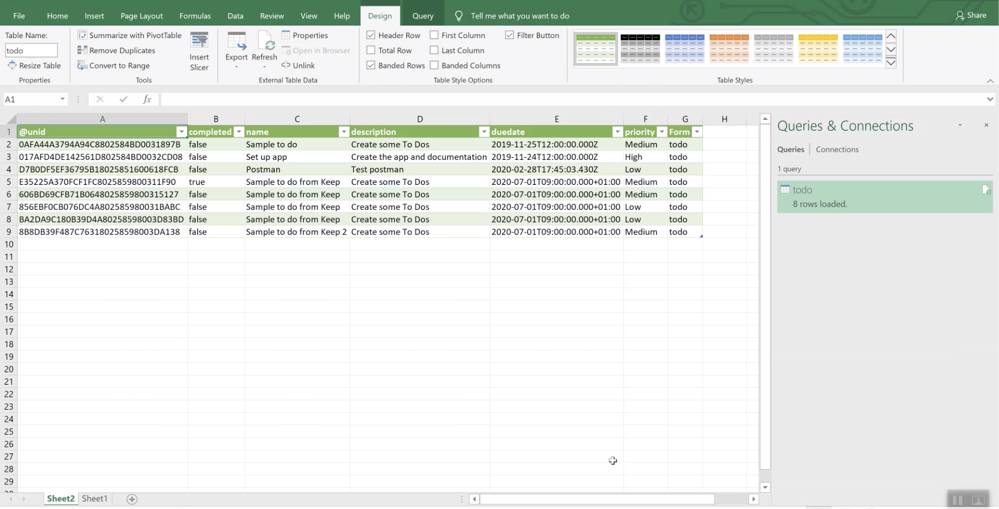
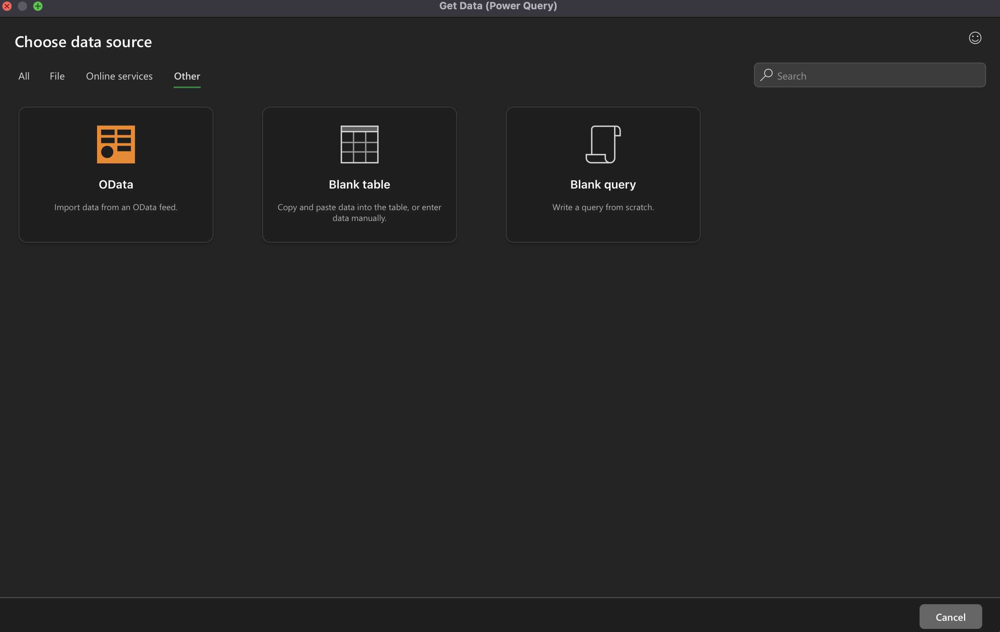
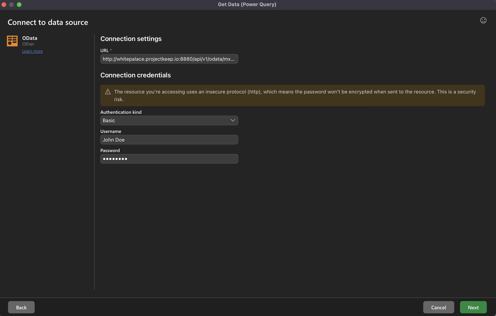
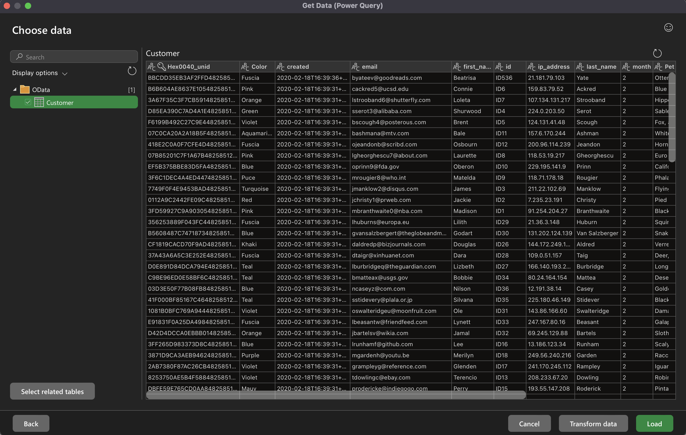
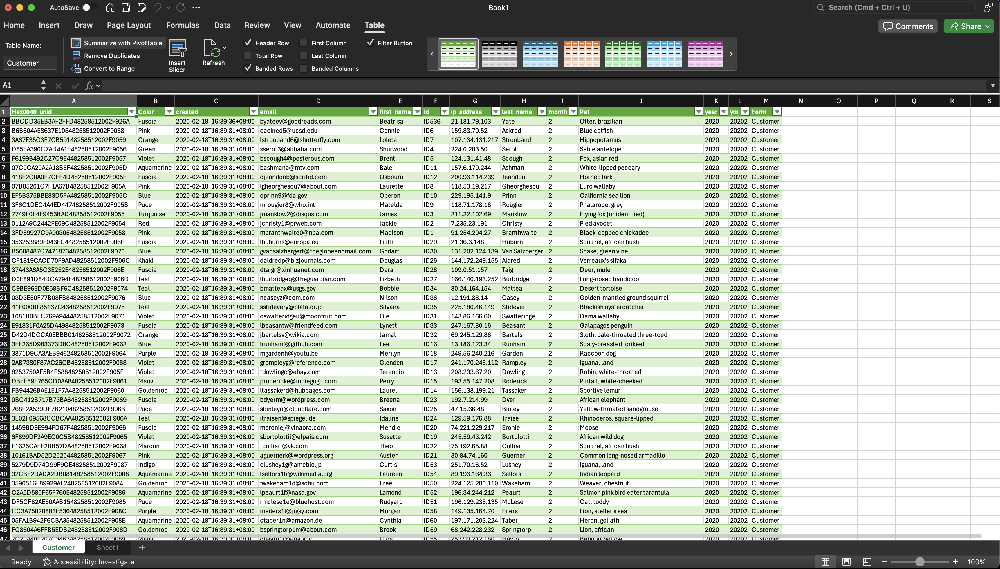

# Access Domino OData in MS-Excel

The Domino REST API allows exporting of data from Notes databases to [OData](https://www.odata.org) format, which can then be read by applications like Excel for Windows and Mac, Salesforce, SAP and Business Intelligence.
This means that the data in a Notes database can be displayed in something as simple as Excel with just a few clicks.

## For Windows

1. Open Microsoft Excel[^1] and create a Blank Workbook.
2. Select **Data** &rarr; **Get Data** &rarr; **From Other Sources** &rarr; **From ODataFeed**.

      

3. Point it to an application on the Domino server. In the example, it's pointed to a To-do application.

      

4. Click **OK**.

      

5. Select **Load** to display the Notes data in Excel. The structure of the Notes database is understood.

      

## For Mac

1. Open Microsoft Excel[^1] and create a Blank Workbook.
2. Go to **Data**&nbsp;&rarr;&nbsp;**Get Data (Power Query)**&nbsp;&rarr;&nbsp;**Other**, and then select **OData**.

      

3. For **Connection settings**, enter your Domino REST API OData endpoint to the **URL** field.

      For example: `https://restapi.myhost.com/api/v1/odata/scopename`

      where:

      - `https://restapi.myhost.com` should be replaced with your Domino REST API host
      - `scopename` should be replaced with the name of your specific Domino REST API database

4. For **Connection credentials**, set **Authentication kind** to **Basic** and enter your Domino REST API username and password to the corresponding **Username** and **Password** fields.

      

5. Click **Next**.
6. Select the form you wish to load and a preview of the Excel table is shown on the right side.

      

7. Click **Load**. You can now see the Notes data in your workbook.

      Loading of Notes data might take a while depending on the number of rows.

      

!!! info

    - The Excel sheet is a live document. Any update to the Notes database is seen when you click **Refresh**.
    - At the moment, only basic authentication is supported.

## Additional information

OData feed for MS Excel is read-only, if you want to read and write using MS Excel, you can try out [Virtual Spreadsheet](../../howto/production/virtualsheet.md).

[^1]: Microsoft and Microsoft Excel are registered trademarks or trademarks of Microsoft Corporation in the United States and/or other countries.
