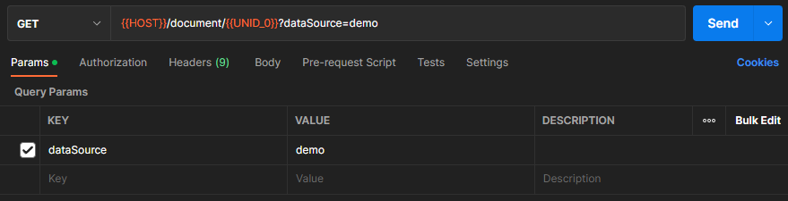

# Using Postman and curl

This tutorial shows how to use Domino REST API using Postman and curl. To follow the tutorial:

- [Download](../references/downloads.md#demonsf) the database `Demo.nsf`.
- [Download](../references/downloads.md#postman) and use the Postman collection and environment.

!!! note

    You must install Postman and curl on your workstation. For more information, see [User tools](../references/usertools.md).
    

## Prepare database access

- Download `Demo.nsf` from [Resources](../references/downloads.md) and save it in the Notes data directory.

## Login

### Postman

1. Start Postman and import the Postman collection and environment you downloaded.
2. Open the Domino REST API Environment by clicking **Environments** and selecting `Domino REST API`.
3. Find and set the `AdminName` and `AdminPassword` initial value variables in your Postman environment with your username and password values.
4. You may need to also update the `HOST`, `SETUPHOST`, `ADMINHOST` and `METRICSADMINHOST` with the correct URL to your Domino server. If you are using the Notes client, the default, `localhost` should be ok.
5. Click **Save**.
6. Go to **Collections** and expand `Domino REST API`.
7. Expand `Authentication` and select `Admin Login`
8. Click **Send** to execute the command.


### curl

Replace `$password` with your password value and `$username` with your username value.

```bash
curl --location --request POST 'localhost:8880/api/v1/auth' \
--header 'Content-Type: application/json' \
--data-raw '{
    "password" : $password,
    "username" : $username
}'
```

This will return a bearer token that will be used to replace all `$Bearer` in this tutorial.

## List available databases

Use the following API to list all the databases:

### Postman


### curl

Replace `$Bearer` with the bearer token from login.

```bash
curl --location --request POST 'localhost:8880/api/setup-v1/admin/access' \
--header 'Authorization: Bearer $Bearer' \
--header 'Content-Type: application/json' \
--data-raw '{
    "checkAllNsf": true,
    "onlyConfigured": false
}'
```

You should be able to see `Demo.nsf` in the list of databases if it's in the Notes data directory.

## Create a schema

Use the following to create a schema:

### Postman


### curl

Replace `$Bearer` with the bearer token from login.

```bash
curl --location --request POST 'localhost:8880/api/setup-v1/schema?nsfPath=Demo.nsf&configName=demo' \
--header 'Authorization: Bearer $Bearer' \
--header 'Content-Type: application/json' \
--data-raw '{
    "apiName": "demo",
    "name": "demo",
    "description": "Demo database",
    "nsfPath": "Demo.nsf",
    "icon": "Base64 stuff, preferably SVG",
    "iconName": "mountain",
    "isActive": true,
    "requireRevisionToUpdate": false,
    "formulaEngine": "domino",
    "openAccess": true,
    "allowCode": true,
    "dqlAccess": true,
    "dqlFormula": {
        "formulaType": "domino",
        "formula": "@True"
    },
    "views": [
        {
            "name": "Customers",
            "alias": [
                "Customers"
            ],
            "unid": "86C72C1BF64B6DF04825847100373215"
        },
        {
            "name": "MarketingInfo",
            "alias": [
                "MarketingInfo"
            ],
            "unid": "10EA9EC66EA748BC4825851100420810"
        },
        {
            "name": "ChineseCustomers",
            "alias": [
                "ChineseCustomers"
            ],
            "unid": "3FE5CD63E179F21600258680006DB25B"
        },
        {
            "name": "($All)",
            "alias": [
                "($All)"
            ],
            "unid": "0E35D520A1EBBB5B48258435003E8284"
        },
        {
            "name": "Samples",
            "alias": [
                "Samples"
            ],
            "unid": "5318911D496571410025860D00544B17"
        }
    ],
    "forms": [
        {
            "formName": "Customer",
            "formModes": [
                {
                    "modeName": "default",
                    "fields": [
                        {
                            "name": "Form",
                            "type": "string",
                            "readOnly": true,
                            "fieldGroup" : "thing",
                            "multivalue" : true
                        },
                        {
                            "name": "Pet",
                            "type": "string"
                        },
                        {
                            "name": "color",
                            "type": "string"
                        },
                        {
                            "name": "email",
                            "type": "string"
                        },
                        {
                            "name": "employee_count",
                            "type": "integer"
                        },
                        {
                            "name": "first_name",
                            "type": "string"
                        },
                        {
                            "name": "last_name",
                            "type": "string"
                        },
                        {
                            "name": "hobbies",
                            "type": "array",
                            "items": {
                                "type": "string"
                            }
                        },
                        {
                            "name": "Owner",
                            "type": "string",
                            "format": "authors"
                        },
                        {
                            "name": "Body",
                            "type": "object",
                            "format": "richtext"
                        }
                    ],
                    "required": [
                        "Form",
                        "email",
                        "first_name"
                    ],
                    "readAccessFormula": {
                        "formulaType": "domino",
                        "formula": "@True"
                    },
                    "writeAccessFormula": {
                        "formulaType": "domino",
                        "formula": "@True"
                    },
                    "deleteAccessFormula": {
                        "formulaType": "domino",
                        "formula": "@False"
                    },
                    "computeWithForm": false
                },
                {
                    "modeName": "dql",
                    "fields": [
                        {
                            "name": "Form",
                            "type": "string",
                            "readOnly": true
                        },
                        {
                            "name": "Pet",
                            "type": "string"
                        },
                        {
                            "name": "color",
                            "type": "string"
                        },
                        {
                            "name": "email",
                            "type": "string"
                        },
                        {
                            "name": "first_name",
                            "type": "string"
                        },
                        {
                            "name": "last_name",
                            "type": "string"
                        },
                        {
                            "name": "hobbies",
                            "type": "array",
                            "items": {
                                "type": "string"
                            }
                        }
                    ],
                    "required": [
                        "Form",
                        "email",
                        "first_name"
                    ],
                    "readAccessFormula": {
                        "formulaType": "domino",
                        "formula": "@True"
                    },
                    "writeAccessFormula": {
                        "formulaType": "domino",
                        "formula": "@True"
                    },
                    "deleteAccessFormula": {
                        "formulaType": "domino",
                        "formula": "@False"
                    },
                    "computeWithForm": false
                }
            ]
        },
        {
            "formName": "Marketing",
            "formModes": [
                {
                    "modeName": "default",
                    "fields": [
                        {
                            "name": "Form",
                            "type": "string",
                            "readOnly": true
                        },
                        {
                            "name": "Assets",
                            "type": "string"
                        },
                        {
                            "name": "Country",
                            "type": "string"
                        },
                        {
                            "name": "FullName",
                            "type": "string"
                        },
                        {
                            "name": "Industry",
                            "type": "string"
                        },
                        {
                            "name": "Newsletter",
                            "type": "string"
                        },
                        {
                            "name": "email",
                            "type": "string"
                        },
                        {
                            "name": "gender",
                            "type": "string",
                            "writeOnly": true
                        }
                    ],
                    "readAccessFormula": {
                        "formulaType": "domino",
                        "formula": "@True"
                    },
                    "writeAccessFormula": {
                        "formulaType": "domino",
                        "formula": "@True"
                    },
                    "deleteAccessFormula": {
                        "formulaType": "domino",
                        "formula": "@False"
                    },
                    "computeWithForm": false
                }
            ]
        },
        {
            "formName": "SampleForm",
            "formModes": [
                {
                    "modeName": "default",
                    "fields": [
                        {
                            "name": "Color",
                            "type": "string"
                        },
                        {
                            "name": "Form",
                            "type": "string"
                        },
                        {
                            "name": "Shape",
                            "type": "string"
                        },
                        {
                            "name": "Taste",
                            "type": "string"
                        }
                    ],
                    "readAccessFormula": {
                        "formulaType": "domino",
                        "formula": "@True"
                    },
                    "writeAccessFormula": {
                        "formulaType": "domino",
                        "formula": "@True"
                    },
                    "deleteAccessFormula": {
                        "formulaType": "domino",
                        "formula": "@False"
                    },
                    "computeWithForm": false
                },
                {
                    "modeName": "odata",
                    "fields": [
                        {
                            "name": "Color",
                            "type": "string"
                        },
                        {
                            "name": "Form",
                            "type": "string"
                        },
                        {
                            "name": "Shape",
                            "type": "string"
                        },
                        {
                            "name": "Taste",
                            "type": "string"
                        }
                    ],
                    "readAccessFormula": {
                        "formulaType": "domino",
                        "formula": "@True"
                    },
                    "writeAccessFormula": {
                        "formulaType": "domino",
                        "formula": "@True"
                    },
                    "deleteAccessFormula": {
                        "formulaType": "domino",
                        "formula": "@False"
                    },
                    "computeWithForm": false
                }
            ]
        }
    ],
    "formAliases": {
        "Entry": "Entry",
        "SampleEntry": "SampleEntry",
        "Customer": "Customer"
    }
}'

```

The created schema would have configured forms and views.

## Create a scope

Use the following to create a scope for the schema we created:

### Postman


### curl

Please replace `$Bearer` with the bearer token from login.

```bash
curl --location --request POST 'localhost:8880/api/setup-v1/admin/scope?createSchema=true' \
--header 'Authorization: Bearer $Bearer' \
--header 'Content-Type: application/json' \
--data-raw '{
    "apiName": "demo",
    "schemaName": "demo",
    "nsfPath": "Demo.nsf",
    "isActive": true
}'
```

## Verify the forms for the demo database

Use the following to check the forms in the database:

### Postman


### curl

Please replace `$Bearer` with the bearer token from login and `$scope` with the demo scope name.

```bash
curl --location --request GET 'localhost:8880/api/setup-v1/design/forms?dataSource=$scope' \
--header 'Authorization: Bearer $Bearer' \
--header 'Accept: application/json'
```

## Verify the views for the demo database

Use the following to check the views in the database:

### Postman


### curl

Replace `$Bearer` with the bearer token from login and `$scope` with the demo scope name.

```bash
curl --location --request GET 'localhost:8880/api/v1/lists?dataSource=$scope' \
--header 'Authorization: Bearer $Bearer' \
--header 'Accept: application/json'
```

## Create document

Use the following to create a document:

### Postman


### curl

Replace `$Bearer` with the bearer token from login and `$scope` with the demo scope name.

```bash
curl --location --request POST 'localhost:8880/api/v1/document?dataSource=$scope' \
--header 'Authorization: Bearer $Bearer' \
--header 'Content-Type: application/json' \
--data-raw '{
    "first_name": "George",
    "last_name": "Branthwaite",
    "email": "gbranthwaite0@nba.com",
    "gender": "Male",
    "ip_address": "91.254.204.27",
    "Color": "Red",
    "Pet": "Black-capped chickadee",
    "Form": "Customer"
}'
```

## Retrieve document

Use the following to retrieve a document:

### Postman



### curl

Replace `$Bearer` with the bearer token from login, `$UNID` with the UNID from the previously created document and `$scope` with the demo scope name.

```bash
curl --location --request GET 'localhost:8880/api/v1/document/$UNID?dataSource=$scope' \
--header 'Authorization: Bearer $Bearer'
```

## Delete document

Use the following command to delete a document:

### Postman


### curl

Replace `$Bearer` with the bearer token from login, `$UNID` with the UNID from the previously created document and `$scope` with the demo scope name.

```bash
curl --location --request DELETE 'localhost:8880/api/v1/document/$UNID?dataSource=$scope' \
--header 'Authorization: Bearer $Bearer'
```

### Verify document deletion

To verify document deletion, try getting it again using the retrieve command shown before. The retrieve should fail.

## Logout

Use the following command to log out:

### Postman


### curl

Replace `$Bearer` with the bearer token.

```bash
curl --location --request POST 'localhost:8880/api/v1/auth/logout' \
--header 'Content-Type: application/json' \
--header 'Authorization: Bearer $Bearer' \
--data-raw '{
    "logout" : "Yes"
}'
```

## Shutdown

Use the following command to shut down the Domino REST API server:

### Postman


### curl

Replace `$Bearer` with the bearer token.

```bash
curl --location --request POST 'localhost:8889/shutdown' \
--header 'Authorization: Bearer $Bearer' \
--header 'Content-Type: application/json' \
--data-raw '{
	"shutdownkey" : "The End is near!!",
	"StopServer" : true
}'
```
