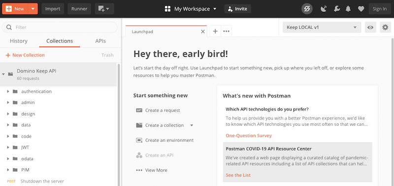
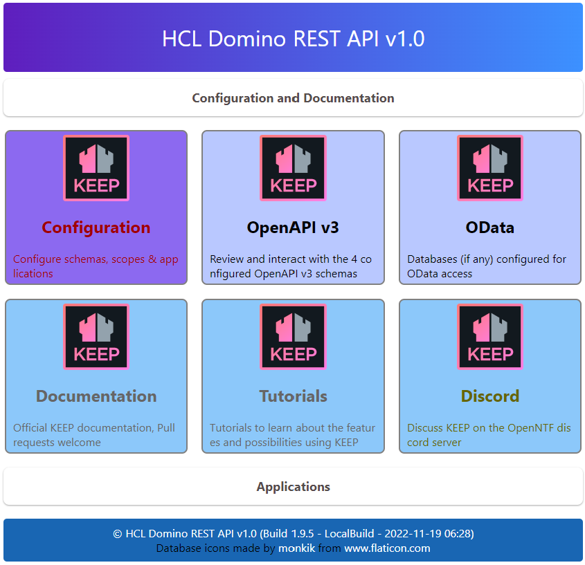
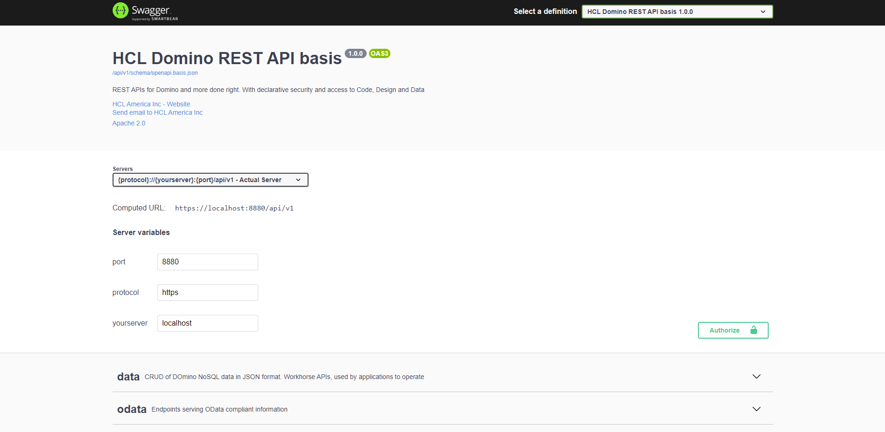
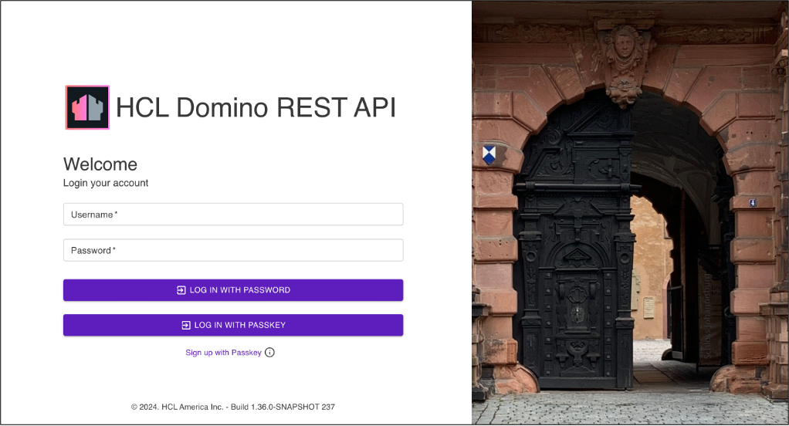
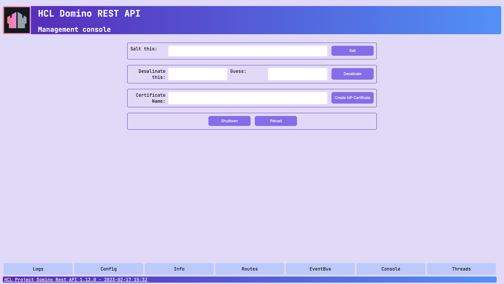
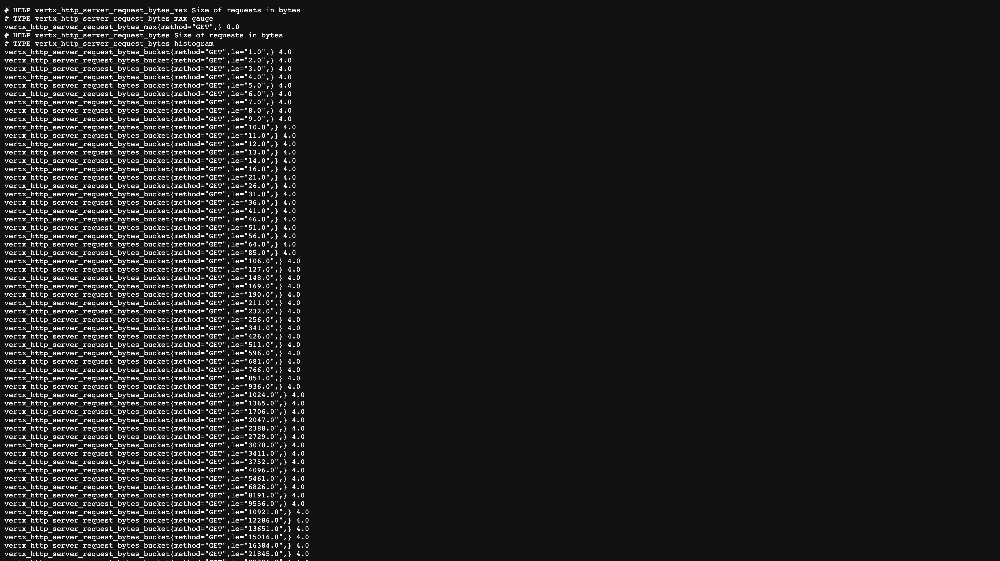

# Quickstart

This guide allows new users with working experience in HCL Notes and HCL Domino to quickly get started with Domino REST API. These are the steps:

- Download the installer or Container (a.k.a. Docker) image

- [Install](installconfig/index.md) and run the REST API

- Follow [the tutorials](../tutorial/index.md) to learn about [AdminUI](../tutorial/adminui.md)

- Read the introduction to the concepts, especially [schemas and scopes](../topicguides/understanding.md)

- Get to know [Postman and curl](../tutorial/postmancurl.md), two invaluable tools for REST usage

## Downloading Domino REST API

Log in to [HCL Software License & Download Portal](https://hclsoftware.flexnetoperations.com/ "Opens a new tab"){: target="_blank" rel="noopener noreferrer"}&nbsp;{: style="height:15px;width:15px"} or [My HCLSoftware Portal](https://my.hcltechsw.com/ "Opens a new tab"){: target="_blank" rel="noopener noreferrer"}&nbsp;{: style="height:15px;width:15px"} and download Domino REST API.

## Let's connect

--8<-- "feedback.md"

## What's New

Check [What's New](../whatsnew/index.md) to learn what's new in Domino REST API.

## The Domino REST API schema

You will find a snapshot of the Domino REST API schemas [here](../references/openapidefinitions.md). The actual schema however resides on your Domino REST API server instance as OpenAPI specification. You can read and explore it directly with your own data.
{: .alert .alert-danger}

## A few phrases you should know

- A database exposed on the API is referred to as a **scope**. The exposure happens through an entry in Domino REST API's configuration database by an administrator with `Editor` access there. The scope gets used in the URLs as `?dataSource=[scopename]`. Scopes for databases are lowercase only.
- The shape of data available is referred to as a **schema**. The schema is an json file in the design resources of the database. It gets created by a developer with `Designer` access to the NSF.
- A **Domino REST API Application** is an [OAuth](https://oauth.net/) compatible definition of a `client_id` and a `client_secret` as well as the list of permitted scopes.

- A **scope** points to a **schema** that is contained in a database. A database can have [**multiple schemas**](../assets/images/KeepSchemaToApp.png) for different use cases and a **schema** can be pointed to by **more than one scope**.

Pick the name of your **scope** wisely. It's the external name you share with others and thus hard to change without breaking external apps.
{: .alert .alert-danger}

## Let's get started

To get up and running quickly, you will need to:

- [Install](../tutorial/installconfig/index.md) Domino REST API on a Notes client or a Domino server.

- Pick a database you want to work with. You could use [demo.nsf](../references/downloads.md).

- Use the Domino REST API to create a **schema** REST access (if you dare, use Domino Designer).

  - Pick the forms and fields to expose.
  - Pick the views you want to be REST accessible.
  - Pick the agents. (Optional)

- Use the Domino REST API to create a **scope**.
- Try out the API.

You can use the built-in [Swagger API](../tutorial/swagger.md), [Postman and Curl](../tutorial/postmancurl.md), or the [Admin UI](../tutorial/adminui.md). To help you, use one of the following tutorials. We have a curl based [Domino REST API shell script](../references/downloads.md) for you to play with.

<!-- prettier-ignore -->
!!! tip

    Make sure to complete the [post installation steps](../tutorial/installconfig/postinstallation.md) to ensure proper operation.

### Tutorials

- Easy steps [on this site](../tutorial/index.md)

- A [tutorial for the skilled Notes developer](https://opensource.hcltechsw.com/domino-keep-tutorials/pages/todo/index)

- Similar to the previous one, but from the viewpoint of a [skilled web developer](https://opensource.hcltechsw.com/domino-keep-tutorials/pages/domino-new/index#pre-requisites)

- Explore on your own using a [Postman collection](../references/downloads.md)

The [Postman collection](../references/downloads.md) has sample interactions with the local sample `Demo.nsf`, go check it out.

### Roles

- **Domino developer** creates the **schema** that defines what data can be accessed in a nsf database.
- **Domino administrator** creates and activates the **scope** that defines how the data can be accessed. Also creates (optional) OAuth compatible applications with `client_id` and `client_secret` properties.
- **VoltMX administrator** configures Volt MX's foundry middleware to interact with Domino REST API using the foundry Domino REST API adapter
- **Application developer** develops applications leveraging Domino REST API Endpoints, VoltMX services and front-end tools like VoltMX Iris, VSCode or any tools and framework of choice

Read more about them in [Domino REST API roles](../references/usingdominorestapi/roles.md).

### Endpoints

Ensure your endpoints are [secure](../references/security/securingKEEPEndpoints.md).
Bring up a browser and verify that you can hit these endpoints:

| Endpoints | Ports | Details | Webpages |
| ---- | ---- | ---- | ----- |
| [Domino REST API Home Page](http://localhost:8880/) | 8880 | Start page |  |
| [Live Domino REST API](http://localhost:8880/openapi/index.html?url=/api/v1/schema/openapi.core.json) | 8880 | Interact live with the API |  |
| [Admin UI](http://localhost:8880/admin/ui/) | 8880 | Login with an admin user. LocalDomainAdmin member |  |
| [Management API](http://localhost:8889/) | 8889 | Access to the log and runtime info |  |
| [Prometheus Metrics](http://localhost:8890/) | 8890 | Performance info in Prometheus format. Protected with basic authentication (metrics/metrics) |  |
| [Health check endpoint](http://localhost:8886/) | 8886 | Server healthcheck endpoint as used by Kubernetes or Openshift | |
| [Auth](http://localhost:8880/api/v1/auth) | 8880  | The endpoint, `[POST] http/s://${HOST}:8880/api/v1/auth`, is the default end point to exchange Domino web credentials for a JWT access token. For example, use the token in Postman request headers as a Bearer authentication header. You also can use your [own IdP](../howto/IdP/configuringIdentityProvider.md) to gain access tokens | |
 
### What's next?

Based on your interest, start by exploring the following sections of this documentation:

- Dive deeper into [installation and configuration](../tutorial/installconfig/index.md).

- Learn more about [using Domino REST API](../references/usingdominorestapi/index.md).

- Explore the internal [working of Domino REST API](../topicguides/howkeepworks.md) and know more about the [Barbican](../topicguides/barbican.md).
