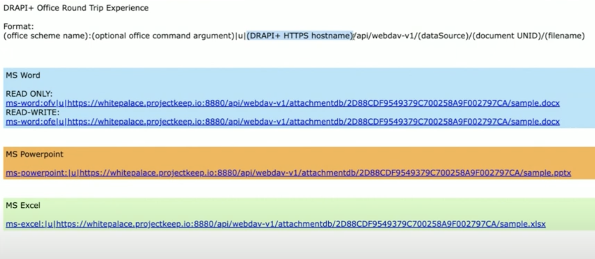
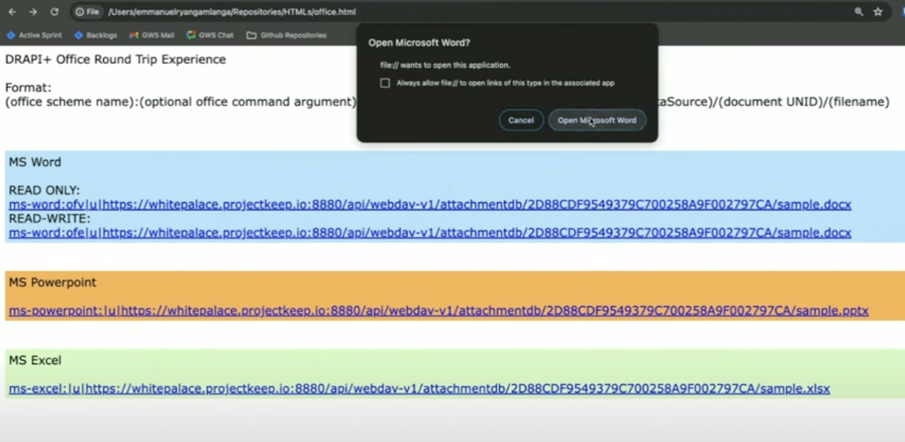
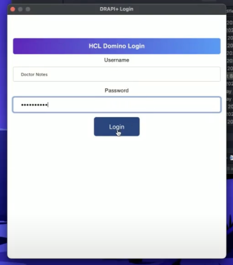
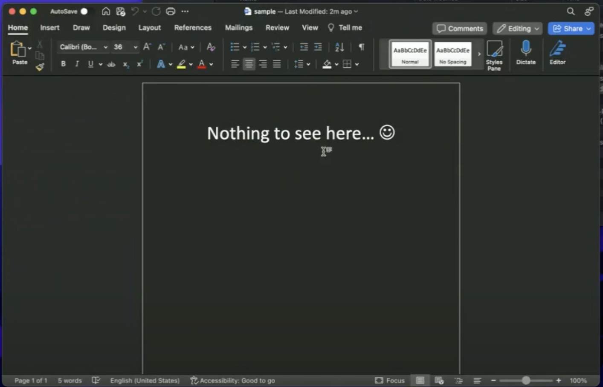
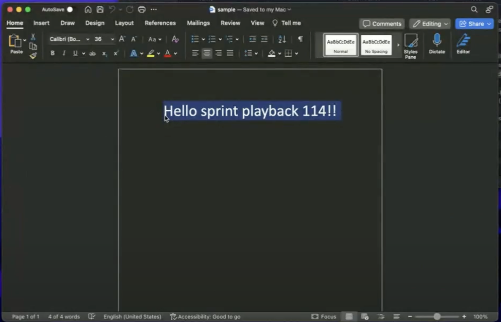

# Setup Office Round Trip Experience

Microsoft Office Round Trip Experience is a feature that is included in the core functionality of the Domino REST API that is responsible for Office files that are attached to Domino documents. This makes editing documents easier by opening Office files directly in their native applications and saving changes back to the Domino server where they were attached.

Now, you only need to click the "**Save**" button once to do everything.

## Prerequisite

- Make sure your computer has Microsoft Office installed or can access Office 365.
- You must run your Domino REST API in HTTPs. 


## Open and edit Office documents

1. **Attach** files in your documents on your Domino server. In order to use the "*office round trip experience*", you must attach any MS Office Word, Powerpoint or Excel or CSV or any file that runs in Microsoft Office.

2. After attaching the file, those Office attachments will be accessible using the following format:
    ```
    (office scheme name):(optional office command argument)|u|(DRAPI+ HTTPs hostname)/api/webdav-v1/(dataSource)/(document UNID)/(filename)
    ```
    Example:

    [ms-word:ofv|u|whitepalace.keepproject.io:8880/api/webdav-v1/attachmentdb/2D88CDF9549379C700258A9F002797CA/sample.docx](ms-word:ofv|u|whitepalace.keepproject.io:8880/api/webdav-v1/attachmentdb/2D88CDF9549379C700258A9F002797CA/sample.docx)
    
    

    |Fomat |Description|
    |:-----|:--------|
    |(office scheme name)| Here is a list of scheme names that have been implemented in Microsoft Office applications. Once Microsoft Office is installed, the operating system registers each scheme name to be managed by the corresponding Office product. <br></br> <br>ms-word:</br><br>ms-powerpoint:</br><br>ms-excel:</br><br>ms-visio:</br><br>ms-access:</br>|
    | office command argument (optional) | Executing this command will prompt the program to open the document specified by the URI in a mode that only allows reading or viewing.  <br></br> <br> ofv - to view the document </br> <br>ofe - to edit the document</br>|
    |Domino REST API hostname| It is the Domino REST API where your Domino document is attached. Note: This feature works only for HTTPs|
    | dataSource | It is the Domino database where your current document is uploaded or attached.|
    | document UNID| The Universal ID in which the document is attached or uploaded.|
    | filename | It is the name of the the file that ends in  Office extension. |

3. **Click** the URL link. When MS Office detects the document extension, it will display a notice prompting the user to open the file in a specific Office document. 

    For details on the file extension of MS-Office that is recognized by **Office Forms Based Authentication**, click on the following [link](../references/ofba.md).

    Example: `sample.docx, sample.xls.`

    
    
    Example link:
    [ms-word:ofv|u|whitepalace.keepproject.io:8880/api/webdav-v1/attachmentdb/2D88CDF9549379C700258A9F002797CA/sample.docx](ms-word:ofv|u|whitepalace.keepproject.io:8880/api/webdav-v1/attachmentdb/2D88CDF9549379C700258A9F002797CA/sample.docx)

3. The **Office Forms Based Authentication (OFBA)** page will appear. **Provide** your login details for the Domino REST API. If your credentials are incorrect, the MS Office will restrict you from opening the document.
    
    !!!info
        One way to handle authentication is by using Office Forms Based Authentication [(OFBA)](https://learn.microsoft.com/en-us/openspecs/sharepoint_protocols/ms-ofba/30c7bbe9-b284-421f-b866-4e7ed4866027), which includes a link to the format [Office URI schemes](https://learn.microsoft.com/en-us/office/client-developer/office-uri-schemes). This is necessary since browsers and office applications do not currently support cookie and header sharing.

    !!!note
        - For the Office Forms Based Authentication to work, your Domino REST API must be connected to and running on HTTPs.
        - If the command argument is `ofe`, this will open and and lets you edit the document.
        - If the command argument is `ofv`, this will let you open and read only the document.
    
    

4. **Modify** your document, **save** and **close** the Microsoft Office. It will save without downloading on your local and reattach again the document. It will be save on your Domino server.

    !!!tip "Microsoft Office Round Trip edit"
        This feature enables you to access compatible file formats, particularly those commonly used in Microsoft office settings, using their respective native applications. When saving the file, it is sent back to the document on the server. No need to download and reattach again the document.

    In the example, we will going to **modify** the "Nothing to see here" into "Sprint playback 114!!". Do not forget to **save** and **close** the Microsoft app.

    

    Try to open the link again, enter your **OFBA** or your **Domino REST API credentials**. The document has been modified.

    

