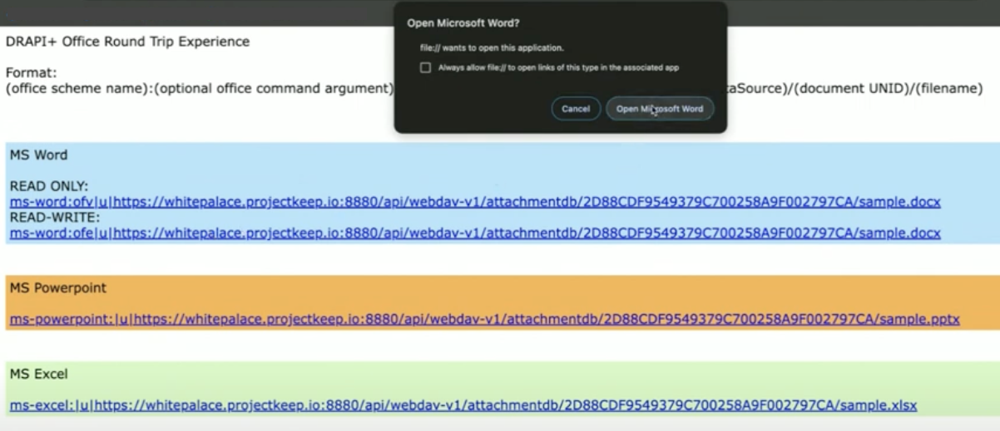
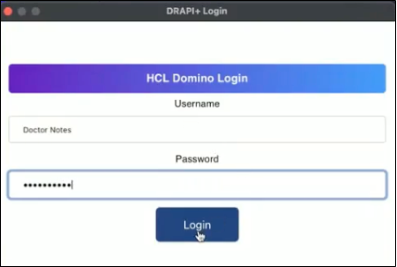

# Setup Office Round Trip Experience

Microsoft Office Round Trip Experience is a feature of the Domino REST API that enhances the functionality of Office files attached to Domino documents. This feature allows developers to enhance user functionality by enabling them to easily launch attachments from the Domino platform using popular Office Document applications such as MS-Word, MS-Excel, and MS-Powerpoint. Users can seamlessly read, edit, and save these attachments without any extra effort. 

It is meant to improve how attachments run in Domino documents. Instead of needing to detach, modify locally, and reattach documents, this URL link enables users to interact with documents directly from within their Domino apps.

## Prerequisite

- You must install the MS Office app or use the Office 365.
- You must need to run your Domino in HTTPs. 


## Open and edit office documents

1. **Attach** files in your documents on your Domino server. Must be any MS Office Word, Powerpoint or Excel or CSV in order to read the Microsoft Office.

2. After attaching the documents, an **URL link** will be generated. It is the developer's responsibility to embed the custom attachment links in a page. 

    

    Here is the format for the generated link:
    
    ```
    (office scheme name):(optional office command argument)|u|(DRAPI+ HTTPS hostname)/api/webdav-v1/(dataSource)/(document UNID)/(filename)
    ```
    
    Example:

    [ms-word:ofv|u|whitepalace.keepproject.io:8880/api/webdav-v1/attachmentdb/2D88CDF9549379C700258A9F002797CA/sample.docx](ms-word:ofv|u|whitepalace.keepproject.io:8880/api/webdav-v1/attachmentdb/2D88CDF9549379C700258A9F002797CA/sample.docx)
    


    |Fomat |Description|
    |:-----|:--------|
    |(office scheme name)| Here is a list of scheme names that have been implemented in Microsoft Office applications. Once Microsoft Office is installed, the operating system registers each scheme name to be managed by the corresponding Office product. <br></br> <br>ms-word:</br><br>ms-powerpoint:</br><br>ms-excel:</br><br>ms-visio:</br><br>ms-access:</br>|
    | office command argument (optional) | Executing this command will prompt the program to open the document specified by the URI in a mode that only allows reading or viewing.  <br></br> <br> ofw - to view the document </br> <br>ofe - to edit the document</br>|
    |Domino Rast API hostname| It is the Domino REST API where your Domino document is attached. Note: This feature works only for HTTPS or HTTP.  |
    | dataSource | It is the Domino database where your current document is uploaded or attached.|
    | document UNID| The Universal ID in which the document is attached or uploaded.|
    | filename | It is the name of the the file that ends in  Office extension. |

3. **Click** the URL link. When MS Office detects the document extension, it will display a notice prompting the user to open the file in a specific Office document.

    

    Example: `sample.docx, sample.xls.`

    Here are the extension that can be read by Microsoft Office Documents:

    ```
    # Generic
    csv=ms-excel:ofv|u|%s,ms-excel:ofe|u|%s

    # Microsoft Word
    doc=ms-word:ofv|u|%s,ms-word:ofe|u|%s
    docm=ms-word:ofv|u|%s,ms-word:ofe|u|%s
    docx=ms-word:ofv|u|%s,ms-word:ofe|u|%s
    dot=ms-word:ofv|u|%s,ms-word:ofe|u|%s
    dotm=ms-word:ofv|u|%s,ms-word:ofe|u|%s
    dotx=ms-word:ofv|u|%s,ms-word:ofe|u|%s

    # Microsoft Powerpoint
    pot=ms-powerpoint:ofv|u|%s,ms-powerpoint:ofe|u|%s
    potm=ms-powerpoint:ofv|u|%s,ms-powerpoint:ofe|u|%s
    potx=ms-powerpoint:ofv|u|%s,ms-powerpoint:ofe|u|%s
    ppt=ms-powerpoint:ofv|u|%s,ms-powerpoint:ofe|u|%s
    pptm=ms-powerpoint:ofv|u|%s,ms-powerpoint:ofe|u|%s
    pptx=ms-powerpoint:ofv|u|%s,ms-powerpoint:ofe|u|%s
    pps=ms-powerpoint:ofv|u|%s,ms-powerpoint:ofe|u|%s
    ppsm=ms-powerpoint:ofv|u|%s,ms-powerpoint:ofe|u|%s
    ppsx=ms-powerpoint:ofv|u|%s,ms-powerpoint:ofe|u|%s
    sldm=ms-powerpoint:ofv|u|%s,ms-powerpoint:ofe|u|%s
    sldx=ms-powerpoint:ofv|u|%s,ms-powerpoint:ofe|u|%s

    # Microsoft Excel
    xla=ms-excel:ofv|u|%s,ms-excel:ofe|u|%s
    xlam=ms-excel:ofv|u|%s,ms-excel:ofe|u|%s
    xlm=ms-excel:ofv|u|%s,ms-excel:ofe|u|%s
    xls=ms-excel:ofv|u|%s,ms-excel:ofe|u|%s
    xlsb=ms-excel:ofv|u|%s,ms-excel:ofe|u|%s
    xlsm=ms-excel:ofv|u|%s,ms-excel:ofe|u|%s
    xlsx=ms-excel:ofv|u|%s,ms-excel:ofe|u|%s
    xlt=ms-excel:ofv|u|%s,ms-excel:ofe|u|%s
    xltm=ms-excel:ofv|u|%s,ms-excel:ofe|u|%s
    xltx=ms-excel:ofv|u|%s,ms-excel:ofe|u|%s
    xlw=ms-excel:ofv|u|%s,ms-excel:ofe|u|%s

    # Microsoft Visio
    vdx=ms-visio:ofv|u|%s,ms-visio:ofe|u|%s
    vsd=ms-visio:ofv|u|%s,ms-visio:ofe|u|%s
    vsdx=ms-visio:ofv|u|%s,ms-visio:ofe|u|%s
    vss=ms-visio:ofv|u|%s,ms-visio:ofe|u|%s
    vst=ms-visio:ofv|u|%s,ms-visio:ofe|u|%s
    vsw=ms-visio:ofv|u|%s,ms-visio:ofe|u|%s
    vsx=ms-visio:ofv|u|%s,ms-visio:ofe|u|%s
    vtx=ms-visio:ofv|u|%s,ms-visio:ofe|u|%s

    # Microsoft Access
    accda=ms-access:ofv|u|%s,ms-access:ofe|u|%s
    accdb=ms-access:ofv|u|%s,ms-access:ofe|u|%s
    accdc=ms-access:ofv|u|%s,ms-access:ofe|u|%s
    accde=ms-access:ofv|u|%s,ms-access:ofe|u|%s
    accdp=ms-access:ofv|u|%s,ms-access:ofe|u|%s
    accdr=ms-access:ofv|u|%s,ms-access:ofe|u|%s
    accdt=ms-access:ofv|u|%s,ms-access:ofe|u|%s
    accdu=ms-access:ofv|u|%s,ms-access:ofe|u|%s
    mdb=ms-access:ofv|u|%s,ms-access:ofe|u|%s

    # Microsoft Project
    mpd=ms-project:ofv|u|%s,ms-project:ofe|u|%s
    mpp=ms-project:ofv|u|%s,ms-project:ofe|u|%s
    mpt=ms-project:ofv|u|%s,ms-project:ofe|u|%s

    # Microsoft Publisher
    pub=ms-publisher:ofv|u|%s,ms-publisher:ofe|u|%s

    # Microsoft InfoPath
    xsn=ms-infopath:ofv|u|%s,ms-infopath:ofe|u|%s
    xsf=ms-infopath:ofv|u|%s,ms-infopath:ofe|u|%s

    ```
    Example:
    [ms-word:ofv|u|whitepalace.keepproject.io:8880/api/webdav-v1/attachmentdb/2D88CDF9549379C700258A9F002797CA/sample.docx](ms-word:ofv|u|whitepalace.keepproject.io:8880/api/webdav-v1/attachmentdb/2D88CDF9549379C700258A9F002797CA/sample.docx)

3. The **Office Form Base Authentication (OFBA)** page will appear. **Provide** your login details for the Domino Rest API. If your credentials are incorrect, the MS Office will restrict you from opening the document.

    !!!note
        - For the Office Form Base Authentication to work, your Domino Rest API must be connected to and running on HTTPs.
        - If the command argument is `ofe`, this will open and and lets you edit the document.
        - If the command argument is `ofw`, this will let you open and read only the document.
    
    

4. **Modify** your document, **save** and **close** the Microsoft Office. It will save without downloading on your local and reattach again the document. It will be save on your Domino server.

    In the example, we will going to modify the "Nothing to see here" into "Sprint playback 114!!". 

    

    Try to open the link again, enter your **OFBA** or your **Domino Rest API credentials**. The document has been modified.

    

!!!tip "Microsoft Office Round Trip edit"
    This feature enables you to access compatible file formats, particularly those commonly used in Microsoft office settings, using their respective native applications. This speeds up the process of downloading. When saving the file, it is sent back to the document on the server. No need to download and reattach again the document.