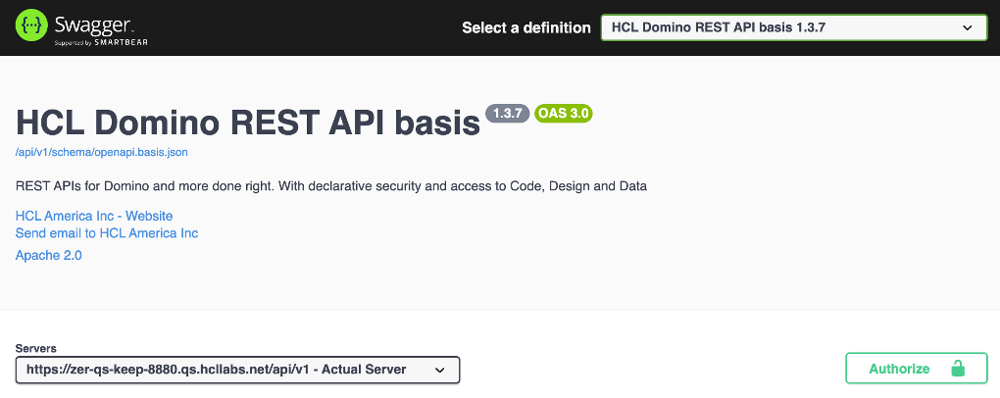
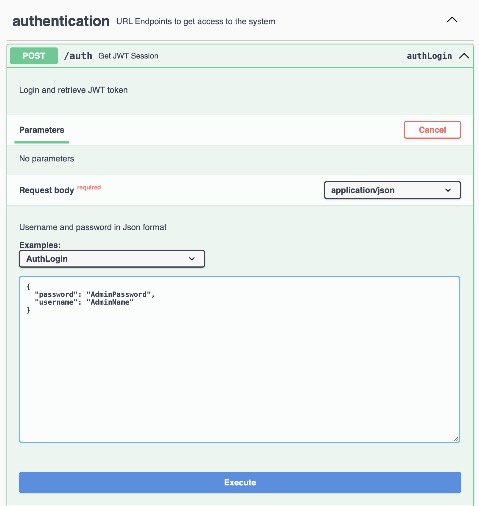
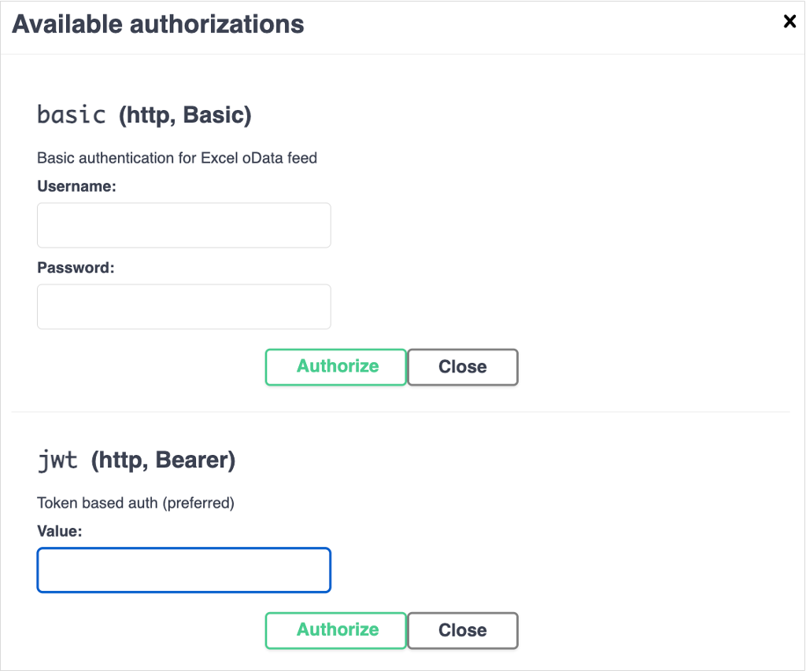
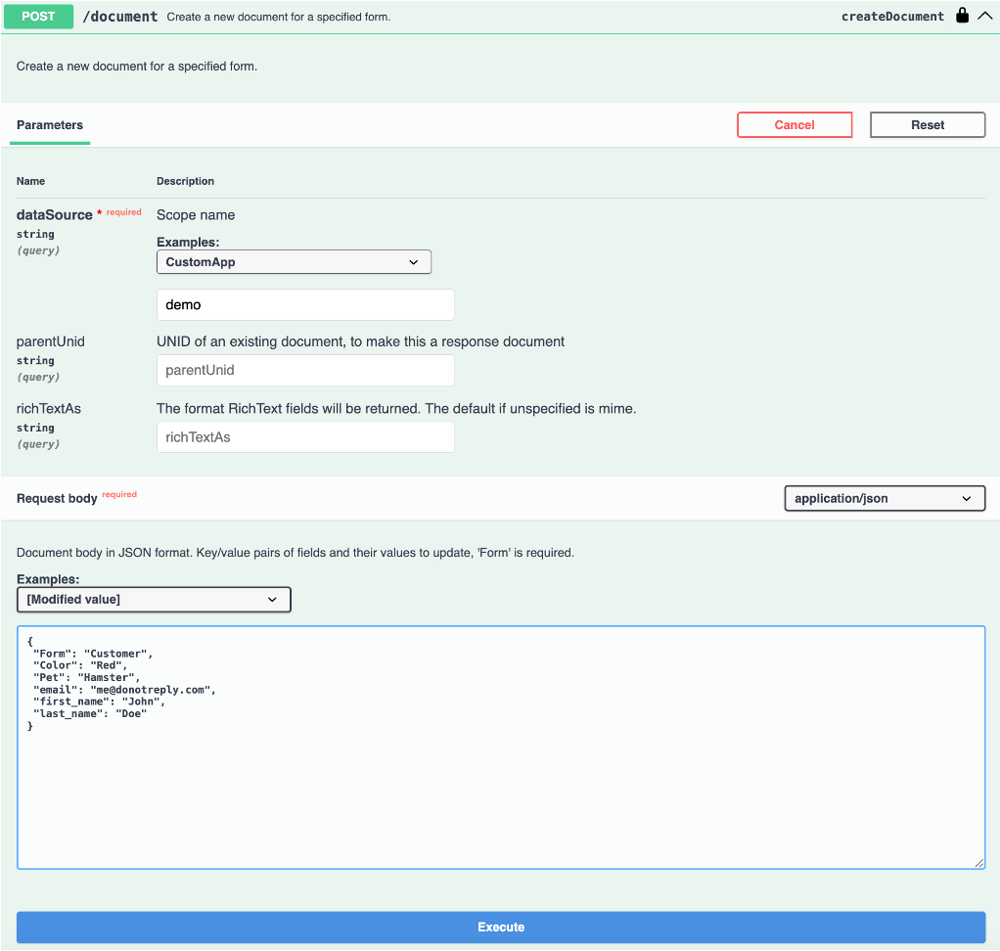
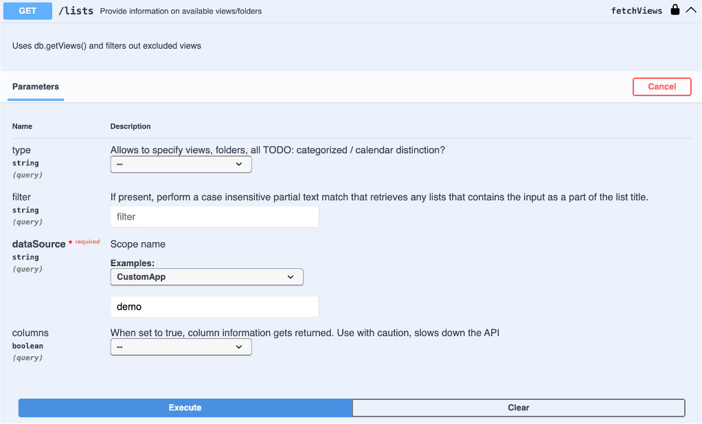
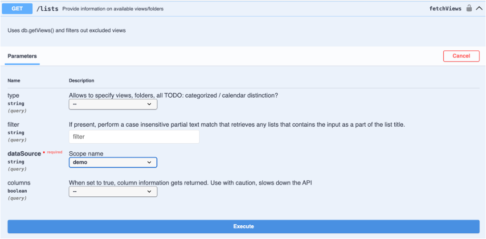

# OpenAPI UI (a.k.a. Swagger)

This tutorial shows how to use the OpenAPI UI (a.k.a. Swagger) to create a document and to list views. For an introduction, see [Swagger UI](../references/usertools/swagger.md).

The [SwaggerUI](https://github.com/swagger-api/swagger-ui) is an OpenSource component supported/maintained by [SmartBear](https://swagger.io) and packaged into a [WebJar](https://www.webjars.org) to render the collection of definitions that constitute the Domino REST API.

<!-- prettier-ignore -->
!!! note "URLs in this tutorial"
    The URLs in this tutorial point to a local instance of the Domino REST API. When you want to follow it on your own remote server, you need to replace `http://localhost` with your server address.

## Create a document with SwaggerUI

1. Go to [SwaggerUI](http://localhost:8880/openapi/index.html).

2. Provide the server variables as shown:

      

3. Create the JWT token for authorization: Scroll to the authentication section, expand it and expand the `/auth` end point. Click on "Try it out". Update the request body with username and password and click execute. When your credentials are valid, the returned JSON will contain the JWT token in the `bearer` element. Copy the token.

      

4. Scroll back up to the Authorize button, click it, paste the JWT token in and click **Authorize**.

      

5. Scroll to the data section, expand it, scroll to "POST /document", expand it. Click on "Try it out", enter all the mandatory field values (like below), and then click **Execute**.

   ```json
   {
     "Form": "Customer",
     "Color": "Red",
     "Pet": "Hamster",
     "email": "me@donotreply.com",
     "first_name": "John",
     "last_name": "Doe"
   }
   ```

   

   Observe what happens when you supply less fields.

### List views with SwaggerUI

1. Follow Steps of authorization from above.

2. Go to the required API, enter the dataSource value, and then click **Execute**.

   

### View the SwaggerUI for a specific KEEP Database

1. In the Explore field in the banner, enter `/api/v1/openapi?dataSource=demo`. This will display the KEEP OpenAPI specification specifically for the demo database.

2. Review the endpoints. The admin and design APIs aren't included since they're not appropriate for accessing the demo database's data. The `dataSource` parameter is always "demo" because the OpenAPI specification is for that Keep database.

3. Review the Schemas at the bottom. If you haven't specified read/write fields on a form, you will see the genericFormResult/genericFormRequest. If you have specified read or write fields, you will see a schema for `_formName_-_modeName_ Responses`/`_formName_-_modeName_ Requests`.

   

If you URL encode `/api/v1/openapi?dataSource=demo`, you can create a URL to share with developers who consume the Domino REST API for that database. The URL encoded value should be appended as the "url" querystring parameter. The resulting URL will look like `http://localhost:8880/openapi/index.html?url=/api/v1/openapi%3FdataSource%3Ddemo`, where the Domino REST API database name is after the `%3D` (url encoded "=").
