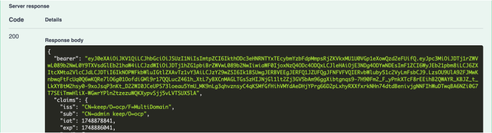
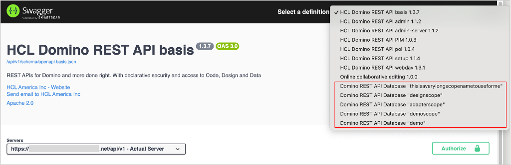
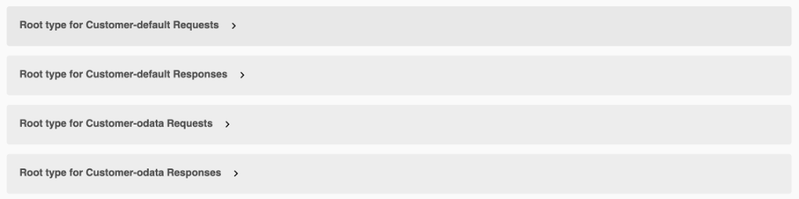

# Using Swagger UI 
<!--OpenAPI UI (a.k.a. Swagger)-->

## Overview

This tutorial guides you through using the Swagger UI to visualize and interact with the Domino REST API endpoints.

The Swagger UI is an open source component supported and maintained by [SmartBear](https://swagger.io) and packaged into a [WebJar](https://www.webjars.org) to render the collection of definitions that constitute the Domino REST API. It enables you to visualize and interact with APIs without having any of the actual implementation logic in place. The APIs are automatically generated from the [OpenAPI Specification](https://swagger.io/specification/) with the visual documentation making it easier to implement the back end code at a later stage.

<!--
You can access the Swagger UI for Domino REST API at `http://localhost:8880`.

!!! note

    The URLs in this tutorial point to a local instance of the Domino REST API. When you want to follow it on your own remote server, you need to replace `http://localhost` with your server address.

This tutorial shows how to use the Swagger UI to:

- [create a JWT token for authorization](#create-a-jwt-token-for-authorization)
- [create a document](#create-a-document-with-swagger-ui)
- [list views](#list-views-with-swagger-ui)
- [view Domino REST API databases](#view-specific-domino-rest-api-database)

The [Swagger UI](https://github.com/swagger-api/swagger-ui) is an OpenSource component supported and maintained by [SmartBear](https://swagger.io) and packaged into a [WebJar](https://www.webjars.org) to render the collection of definitions that constitute the Domino REST API. For an introduction, see [Swagger UI](../references/usertools/swagger.md).


!!! note "URLs in this tutorial"

    The URLs in this tutorial point to a local instance of the Domino REST API. When you want to follow it on your own remote server, you need to replace `http://localhost` with your server address.
-->
## Before you begin

- You have created a schema using the `Demo.nsf` database.
- You have activated the database forms and views of your created schema.
- You have created a scope.

For more information, see [Using Admin UI](../tutorial/adminui.md).

## Video tutorial

You can watch the video for a visual walkthrough of using the Swagger UI. The steps in the video closely follow the instructions in this topic and intend to serve as a visual reference to enhance your understanding. The video shows you the instructions for creating a JWT token for authorization, creating a document, listing views, and working with specific Domino REST API databases.

<div class="iframe-container"><iframe width="600" height="400" src="../assets/video/drapivideo2.mp4" title="Using Admin UI"></iframe></div>

## Authorize with JWT token

You need to create a JWT token and use it to get proper authorization to try out the endpoints. Without proper authorization, you can try executing the endpoints, but you will get an access error.

1. Open Swagger UI by navigating to `http://localhost:8880/openapi/index.html` in your browser.

      The URL points to a local instance of the Domino REST API. To access it from your own remote server, replace `http://localhost` with your server address.

2. Select your server from the **Servers** drop-down list.

      {: style="height:80%;width:80%"}

3. Go to and expand **authentication**, and then expand the **POST /auth** endpoint.

      {: style="height:80%;width:80%"}

4. In the **Request body**, replace the `username` and `password` values with your Domino REST API username and password, and then click **Execute**.

      {: style="height:80%;width:80%"}

      If your credentials are valid, the response will include a JSON object containing the JWT token in the `bearer` key.

      {: style="height:80%;width:80%"}

5. Copy the JWT token string in the `bearer` key.
6. Go to the top of the page and click **Authorize**.

      {: style="height:80%;width:80%"}

7. In the **Available authorizations** dialog, paste the copied JWT token in the **Value** field under **jwt (http, Bearer)**, and then click **Authorize**.

      {: style="height:60%;width:60%"}

8. Close the **Available authorizations** dialog.

## Create a document

1. Go to and expand **data**, and then go to and expand the **POST /document** endpoint.

     {: style="height:80%;width:80%"}

2. Make sure that the scope name provided for the **dataSource** parameter is the same as the scope name you created for your schema.

3. In the **Request body**, enter all the mandatory field values as shown below, and then click **Execute**.

    ```json
    {
     "Form": "Customer",
     "Color": "Red",
     "Pet": "Hamster",
     "email": "me@donotreply.com",
     "first_name": "John",
     "last_name": "Doe"
    }
    ```

    {: style="height:80%;width:80%"}

4. Observe what happens when you supply less fields.

## List views

1. Go to and expand **data**, and then go to and expand the **GET /lists** endpoint.
2. In the **dataSource**, enter the scope name, and then click **Execute**.

      Make sure that the scope name you entered is the same as the scope name you created for your schema.

      {: style="height:80%;width:80%"}

3. Check the **Server Response** to see the information on available views or folders.

      {: style="height:80%;width:80%"}

## Explore specific Domino REST API databases

1. Select a specific Domino REST API database from the **Select a definition** drop-down list.

      {: style="height:80%;width:80%"}

      For example purposes, the Domino REST API database `demo` is going to be selected from the list.

2. Review the endpoints.

      1. Expand the endpoint categories, such as **data**, **authentication**.

         {: style="height:80%;width:80%"}

      2. Review the endpoints.

         The admin and design APIs aren't included since they're not appropriate for accessing the database's data. The value of the `dataSource` parameter always corresponds to the name of the selected Domino REST API database. Based on the example image, the value of the `dataSource` parameter is "demo" because the OpenAPI specification is for that Domino REST API database.

         {: style="height:80%;width:80%"}

3. Review the schemas at the bottom. If you haven't specified read/write fields on a form, you'll see the genericFormResponse/genericFormRequest. If you have specified read or write fields, you'll see a schema for `formName-modeName Responses`/`formName-modeName Requests`.

      In the following example image, the read or write fields have been specified so you can see the schema for `formName-modeName Responses`/`formName-modeName Requests`. Wherein, the `formName` is *Customer* and the `modeName` is *default* and *odata*.

      {: style="height:80%;width:80%"}


You can share the specific Domino REST API database to other developers who also consume the Domino REST API for that database by copying the URL and then sending it to those developers.

<!--If you URL encode `/api/v1/openapi?dataSource=demo`, you can create a URL to share with developers who consume the Domino REST API for that database. The URL encoded value should be appended as the "url" querystring parameter. The resulting URL will look like `http://localhost:8880/openapi/index.html?url=/api/v1/openapi%3FdataSource%3Ddemo`, where the Domino REST API database name is after the `%3D` (url encoded "=").

1. In the Explore field in the banner, enter `/api/v1/openapi?dataSource=demo`. This will display the KEEP OpenAPI specification specifically for the demo database.-->

## Additional information

- Swagger UI homepage: <https://swagger.io/tools/swagger-ui/>
- Swagger UI GitHub page: <https://github.com/swagger-api/swagger-ui>