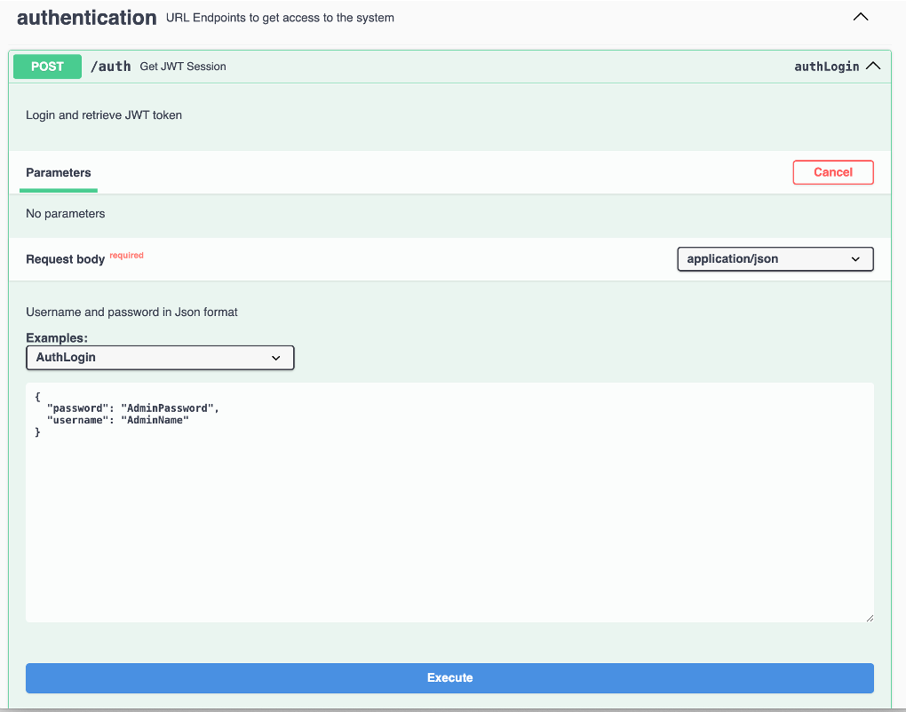

# OpenAPI UI (a.k.a. Swagger)

This tutorial shows how to use the OpenAPI UI (a.k.a. Swagger) to create a document and to list views. For an introduction, see [Swagger UI](../references/usertools/swagger.md).

The [SwaggerUI](https://github.com/swagger-api/swagger-ui) is an OpenSource component supported/maintained by [SmartBear](https://swagger.io) and packaged into a [WebJar](https://www.webjars.org) to render the collection of definitions that constitute the Domino REST API.

<!-- prettier-ignore -->
!!! note "URLs in this tutorial"
    The URLs in this tutorial point to a local instance of the Domino REST API. When you want to follow it on your own remote server, you need to replace `http://localhost` with your server address.

## Create a document with SwaggerUI

1. Go to [SwaggerUI](http://localhost:8880/openapi/index.html).

2. Select your server from the **Servers** drop-down list.

      

3. Create the JWT token for authorization.

      1. Go to and expand **authentication**, and then go to and expand the **POST /auth** endpoint. 
	2. In the **Request body**, update the `username` and `password`, and then click **Execute**. When your credentials are valid, the returned JSON has the JWT token in the `bearer` element.
	3. Copy the JWT token. 

      

4. Scroll back up and click **Authorize**.
5. In the **Available authorizations** dialog, paste the JWT token in the **Value** field under **jwt (http, Bearer)**, and then click **Authorize**.

      

6. Go to and expand **data**, and then go to and expand the **POST /document** endpoint.
7. In the **Request body**, enter all the mandatory field values as shown below, and then click **Execute**.

   ```json
   {
     "Form": "Customer",
     "Color": "Red",
     "Pet": "Hamster",
     "email": "me@donotreply.com",
     "first_name": "John",
     "last_name": "Doe"
   }
   ```

   

   Observe what happens when you supply less fields.

## List views with SwaggerUI

1. Follow the authorization steps in [Create a document with SwaggerUI](#create-a-document-with-swaggerui).
2. Go to and expand **data**, and then go to and expand the **GET /lists** endpoint.
3. In the **dataSource**, enter the scope name, and then click **Execute**.   

   

## View the SwaggerUI for a specific Domino REST API database

1. Select your specific Domino REST API database from the **Select a definition** drop-down list. 
2. Review the endpoints. The admin and design APIs aren't included since they're not appropriate for accessing the demo database's data. The `dataSource` parameter is always "demo" because the OpenAPI specification is for that Domino REST API database.
      
      

3. Review the Schemas at the bottom. If you haven't specified read/write fields on a form, you'll see the genericFormResponse/genericFormRequest. If you have specified read or write fields, you'll see a schema for `formName-modeName Responses`/`formName-modeName Requests`.

   
You can share the specific Domino REST API database to other developers who also consume the Domino REST API for that database by copying the URL and then sending it to those developers. 

<!--If you URL encode `/api/v1/openapi?dataSource=demo`, you can create a URL to share with developers who consume the Domino REST API for that database. The URL encoded value should be appended as the "url" querystring parameter. The resulting URL will look like `http://localhost:8880/openapi/index.html?url=/api/v1/openapi%3FdataSource%3Ddemo`, where the Domino REST API database name is after the `%3D` (url encoded "=").

1. In the Explore field in the banner, enter `/api/v1/openapi?dataSource=demo`. This will display the KEEP OpenAPI specification specifically for the demo database.-->