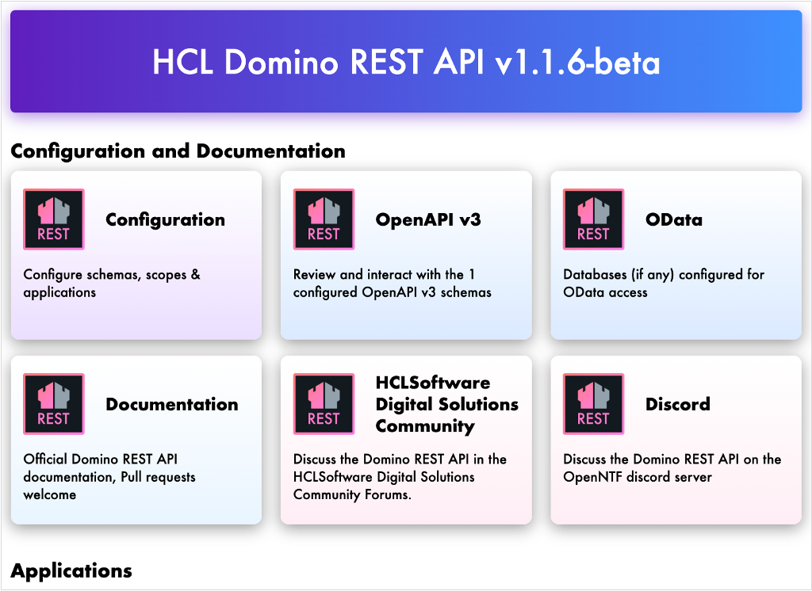

# Lab 0 - Overview

## What you will learn

- How to validate your laptop setup for the workshop.
- Gain a first overview of the Domino REST API.

## Before you begin

- You must have a laptop.
- You must have an internet connection to download the necessary files and tools.
- You have met all the [prerequisites](index.md#prerequisites), such as having Domino REST API installed on a server.

## Procedure

1. Verify the Domino server.

    Confirm you have a running Domino server with admin access. This is mandatory for the exercises.

2. Download the KEEP tool.
    - For Mac/Linux, download [`keep`](../downloads/keep).
    - For Windows, download [`keep.cmd`](../downloads/keep.cmd).
  
    This tool is used if you plan to run Domino REST API locally.

3. Download the database file.

    Download `ApprovalCentral.zip`, which contains the needed Domino database file.

4. Download the Postman [collection](../downloads/dachnug2023.postman_collection.json) & [environment](../downloads/dachnug2023.postman_environment.json).

5. Import the downloaded collection and environment into Postman.

## How to verify

- The following commands should work successfully on your laptop:

    ```bash
    node -v
    java -version
    curl --version
    ```

- Postman is installed and able to start.

- Domino is running with REST API active.

    - If using Domino REST API installed locally, open [http://localhost:8880](http://localhost:8880) in your browser.
    - If connecting to an internet-based Domino REST API server, open your Domino REST API server’s web address.

    You should see a page similar to the following:

    {: style="height:70%;width:70%"}

## Things to explore

- [Domino REST API documentation](https://opensource.hcltechsw.com/Domino-rest-api/index.html)

- [Discord discussion](https://discord.com/invite/jmRHpDRnH4)

- Open the **OpenAPI v3** tile.

## Next step

Proceed to [Lab 01 - Login to the REST API](lab-01.md).

<!--
## Duration 20 min

## What you will learn

- Validate your laptop setup
- Get a first overview of the REST API (presentation by instructor)

## Prerequisites

- Laptop
- Internet connection to download site
- Workshop prerequisites

## Steps (not all are needed)

- Verify that you have a running Domino server with admin access (mandatory).

- Download [`keep`](../downloads/keep) (Mac/Linux) or [`keep.cmd`](../downloads/keep.cmd) (Windows). (This will be used if you're running KEEP locally.)

- Download [ApprovalCentral.zip](../downloads/ApprovalCentral.zip). You need to have an .nsf file to use in the walkthrough.

- Download POSTMAN [collection](../downloads/dachnug2023.postman_collection.json) & POSTMAN [environment](../downloads/dachnug2023.postman_environment.json).
- Import into POSTMAN: environment & collection

## How to check

Commands that should work

```bash
node -v
java -version
curl --version
```

- Postman installed (can start)

- Domino running with REST API active: open [localhost:8880](http://localhost:8880)(if you're using KEEP installed locally) or **web** (your KEEP server if you're connecting to internet) and see:


## Things to explore

- [Domino REST API documentation](https://opensource.hcltechsw.com/Domino-rest-api/index.html)

- [Discord discussion](https://discord.com/invite/jmRHpDRnH4)

- Open the **OpenAPI v3** tile (a.k.a. Swagger)
-->