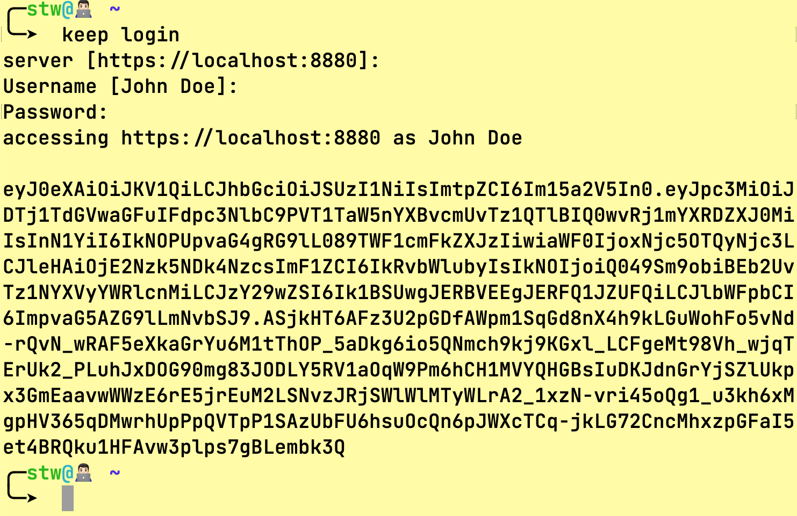
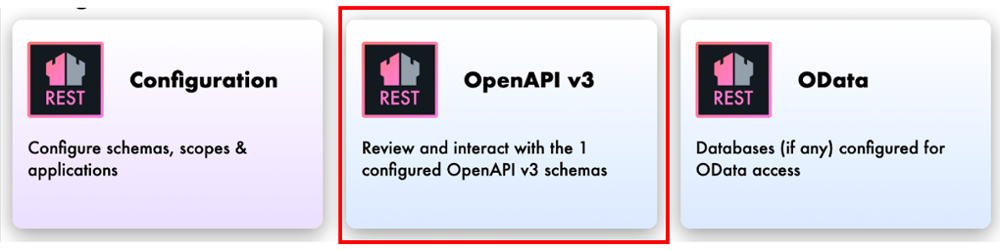
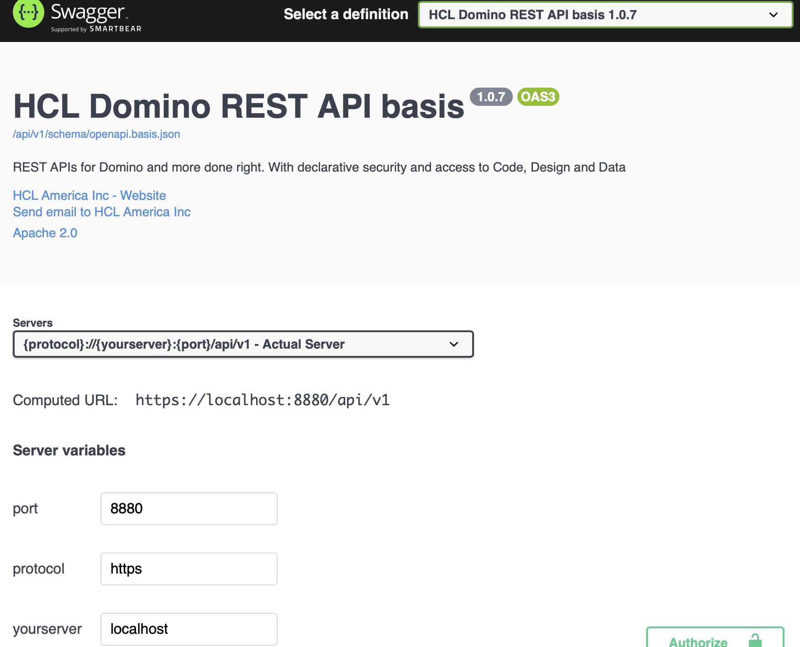
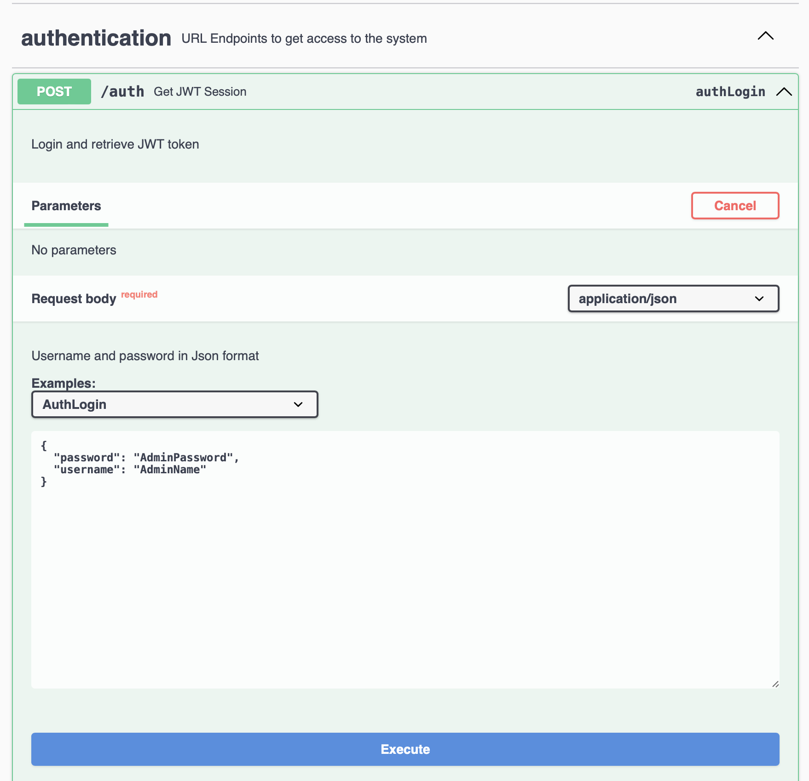
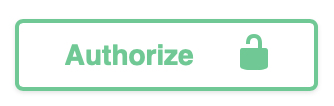
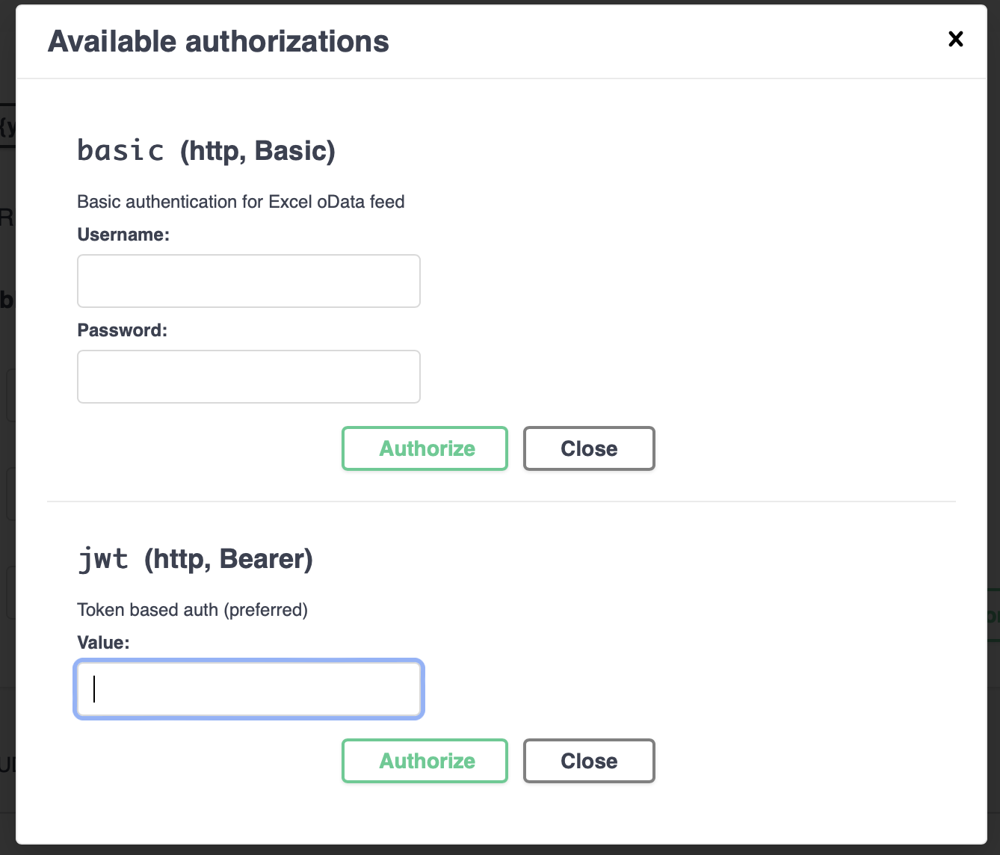
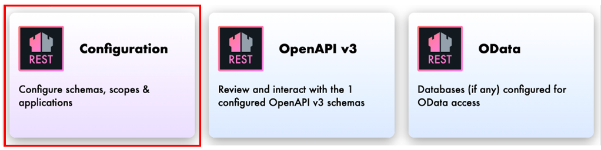
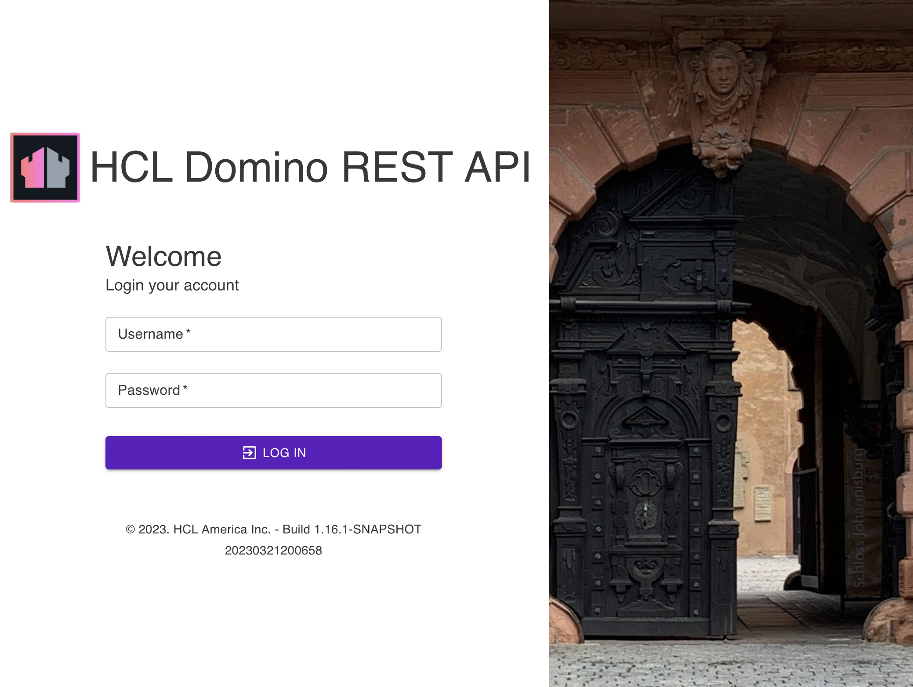
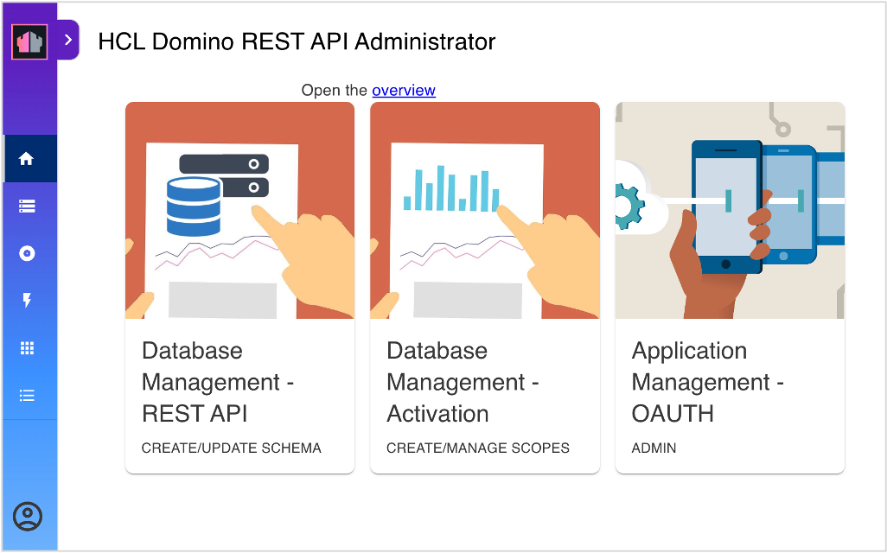
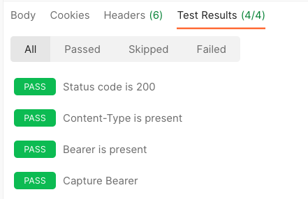

# Lab 01 - Log in to the REST API

## What you will learn

The four different ways to log in to the Domino REST API.

## Before you begin

- You have completed [Lab 0 - Overview](lab-00.md).
- You have a Domino server running with REST API active.
- You have downloaded the KEEP tool: [`keep`](../downloads/keep) for Mac/Linux or [`keep.cmd`](../downloads/keep.cmd) for Windows.

## Procedure

### Set permissions

The database `KeepConfig.nsf` uses the group `LocalKeepAdmins` for access control. You need to create this group in your Domino directory and assign your user account to this group.

!!! note "Use your own credentials"

    The steps below use "KEEP Admin" and "passw0rd" as credentials. Replace those with the admin user on your Domino server.

### Log in to the REST API

#### Log in using the command line

Run the following curl command to log in.

```bash
curl --location --request POST "http://localhost:8880/api/v1/auth" \
   --header 'Content-Type: application/json' \
   --data-raw '{"username" : "KEEP Admin", "password" : "passw0rd"}'
```

!!! note "All on one line"

    The curl command above is one line. To enhance readability, it is broken
    into multiple lines using the "continuation character". On macOS/Linux
    that is `\`. On Windows, that is `^`.

Alternatively, use the `keep login` command.

On successful login, you receive a JSON response containing a token that you can verify on [jwt.io](https://jwt.io/).

{: style="height:70%;width:70%"}

#### Log in using Swagger UI

1. Access the second tile on the Domino REST API landing page.

    {: style="height:70%;width:70%"}

2. Make sure you have the correct port, protocol, and host. For a local installation, this is the set-up:

    | Variable | required value |
    | -------- | -------------- |
    | port     | 8880           |
    | protocol | http           |
    | host     | localhost      |

    {: style="height:70%;width:70%"}

3. Scroll down to `authentication` and expand `authLogin`. Fill in the username and password, and click **Execute**.

    {: style="height:70%;width:70%"}

4. C0py the generated bearer token into the following form, which opens after clicking {: style="height:15%;width:15%"} button.

    {: style="height:70%;width:70%"}

#### Log in to Admin UI

1. Access the first tile on the Domino REST API landing page.

    {: style="height:70%;width:70%"}

2. Fill in your username and password, and click **LOGIN**.

    {: style="height:70%;width:70%"}

    A successful login shows the Admin UI.

    {: style="height:70%;width:70%"}

### Log in using Postman

!!! note

    Make sure you have downloaded the Postman [collection](../downloads/dachnug2023.postman_collection.json) and [environment](../downloads/dachnug2023.postman_environment.json), and have imported them into Postman.

- Start Postman, open the Lab1 folder, and execute the first entry labeled *Login*.

    A successful login shows the bearer token and 4 passed tests.

    {: style="height:60%;width:60%"}

## How to verify

For the methods that return a bearer token, copy the token and verify it in the [JWT Token checker](https://jwt.io/). Take note that each token has a different start time and end time.

## Things to explore

- [Domino REST API documentation](https://opensource.hcltechsw.com/Domino-rest-api/index.html)

- [Discord discussion](https://discord.com/invite/jmRHpDRnH4)

- Call the `/api` endpoint using curl.
- Check the different OpenAPI collections in the Swagger UI.
- Check what happens when invalid credentials are provided.
- Access an endpoint, such as `/api/v1/scopes`, then the logout endpoint and try again.

## Next step

Proceed to [Lab 02 - Quick config](lab-02.md).
<!--
## Duration 10 min

## What you will learn

Four ways to login to the REST API

## Prerequisites

- Lab 0 completed
- Domino with REST running

- downloaded `keep` or `keep.cmd` [from here](downloadindex.md)

## Steps in logging in to the REST API

### Set permissions

The database `KeepConfig.nsf` uses the group `LocalKeepAdmins` for access control. So create that group in your Domino directory and assign your user to it.

!!! note "Use your own credentials"

    The steps below use "KEEP Admin" and "passw0rd" as credentials.
    Replace those with the admin user on your Domino server.

### Login using the command line

```bash
curl --location --request POST "http://localhost:8880/api/v1/auth" \
   --header 'Content-Type: application/json' \
   --data-raw '{"username" : "KEEP Admin", "password" : "passw0rd"}'
```

!!! note "All on one line"

    The command above is one line. To make it more readable, it is broken
    into multiple lines using the "continuation character". On macOS/Linux
    that is `\`. On Windows, that is `^`.

Alternative type `keep login`

You will, on successful login, receive a JSON response that you can verify on [jwt.io](https://jwt.io/).

{: style="height:80%;width:80%"}

### Login using Swagger UI

The second tile on the landing page provides access to the Swagger UI.

{: style="height:80%;width:80%"}

Check you have the correct port, protocol and host. For a local installation, this is the set-up:

| Variable | required value |
| -------- | -------------- |
| port     | 8880           |
| protocol | http           |
| host     | localhost      |

{: style="height:80%;width:80%"}

Scroll down to `authentication` and expand `authLogin`. Fill in the username and password, and click **Execute**.

{: style="height:80%;width:80%"}

Cppy the resulting bearer into the following form, which opens after clicking {: style="height:15%;width:15%"} button.

{: style="height:80%;width:80%"}

### Login to Admin UI

{: style="height:80%;width:80%"}

A successful login shows the Admin UI.

{: style="height:80%;width:80%"}

### Login using Postman

- Download the Postman [collection](../downloads/dachnug2023.postman_collection.json) and [environment](../downloads/dachnug2023.postman_environment.json).

- Open the Lab1 folder, execute the first entry labeled "Login"

The successful login shows the bearer token and 4 passed tests

{: style="height:60%;width:60%"}

## How to check

- All methods return the bearer token. Copy the token and paste it in the [JWT Token checker](https://jwt.io/).

- Each token has a different start/end time.

## Things to explore

- [Domino REST API documentation](https://opensource.hcltechsw.com/Domino-rest-api/index.html)

- [Discord discussion](https://discord.com/invite/jmRHpDRnH4)

- Call the `/api` endpoint using curl.
- Check the different OpenAPI collections in the swagger UI.
- Check what happens when invalid credentials are provided.
- Access an endpoint, such as `/api/v1/scopes`, then the logout endpoint and try again.
-->