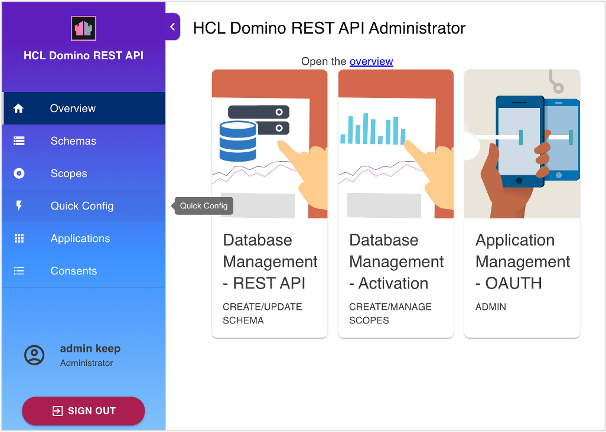
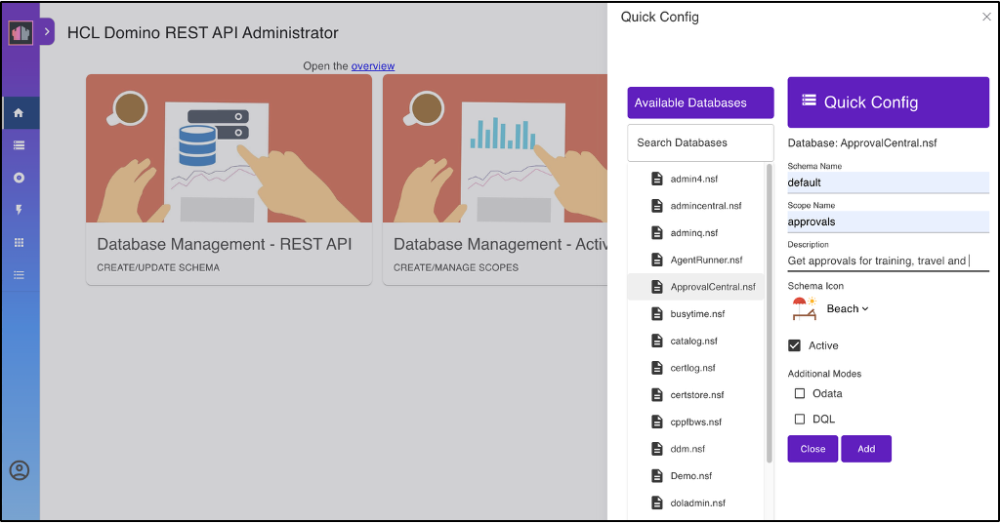
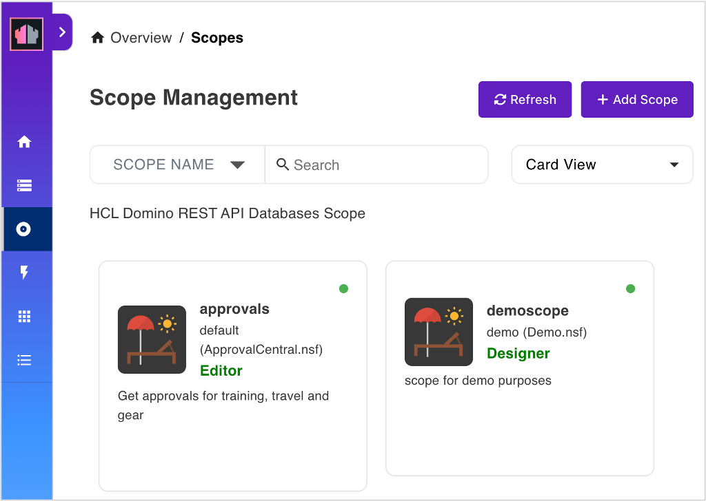
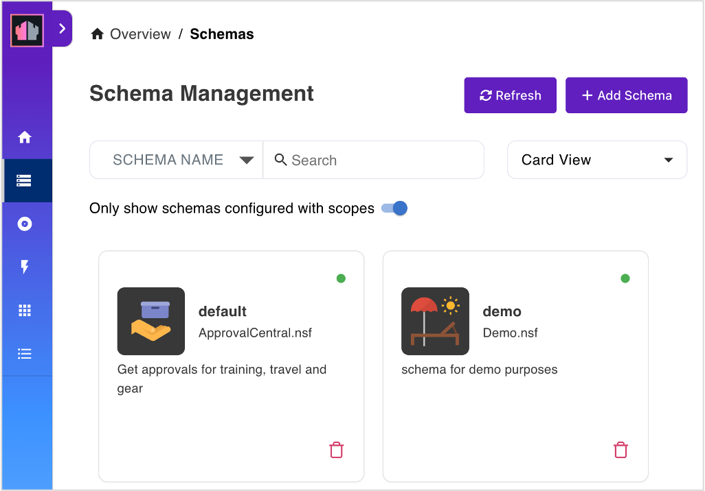
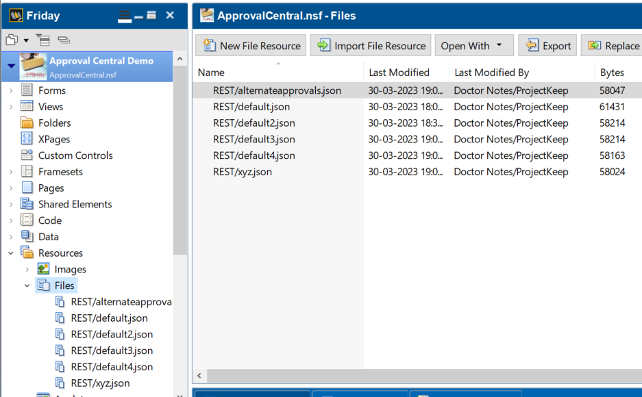
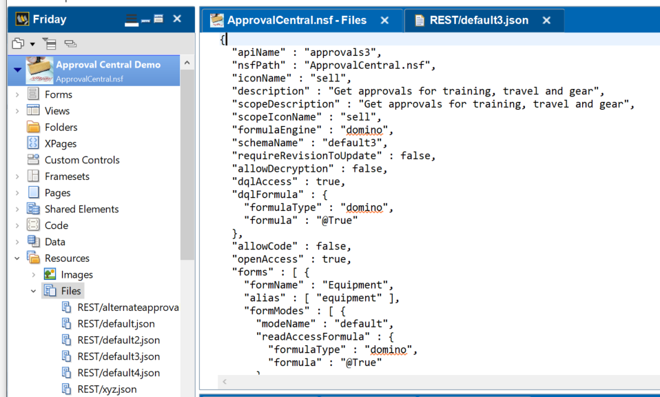

# Lab 02 - Quick config

## Duration 10 min

## What you will learn:

- Navigate the Admin UI
- Configure the "Approval Central" database using the admin UI
- Difference between **Schema** and **Scope**

## Prerequisites

- Lab 01 completed
- Your Domino server running
- Database [ApprovalCentral.nsf](../downloads/ApprovalCentral.zip) deployed to your server.

## Steps in creating a schema and scope in Quick Config

1. Log in to Admin UI.
2. Click on Quick Config.

  

3.  Fill in the form.

  - Schema: default
  - Scope: approvals
  - description & icon: at your discretion

  

4. Click Add.

### Alternative steps

- Use request in Postman's Lab 01 **Create QuickConfig for ApprovalCentral**
- Use curl, postman or the KEEP cli to post this JSON:

```json
{
  "scopeName": "approvals",
  "nsfPath": "ApprovalCentral.nsf",
  "schemaName": "default",
  "create": true
}
```

## How to check

In the Admin UI you will find one entry each for schema and scope:





### URLs to check

- {{HOST}}/api/setup-v1/schemas?nsfPath=ApprovalCentral.nsf
- {{HOST}}/api/setup-v1/schema?nsfPath=ApprovalCentral.nsf&configName=default
- {{HOST}}/api/v1/scopes

## Things to explore

- [Official Domino REST API documentation](https://opensource.hcltechsw.com/Domino-rest-api/index.html)
- [Discord discussion](https://discord.com/invite/jmRHpDRnH4)
- Check the SwaggerUI for the new entry
- Use POSTMAN to create a second quick config using recipe.nsf
- Open Domino Designer to check resources

  

  
