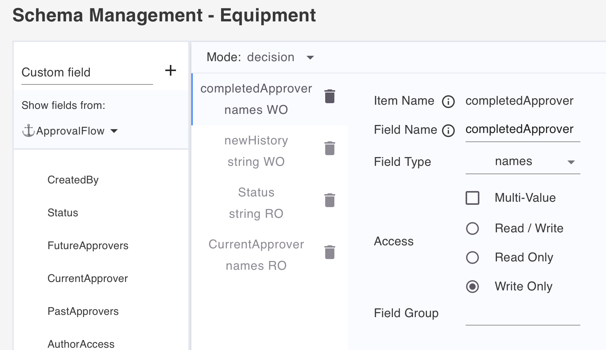
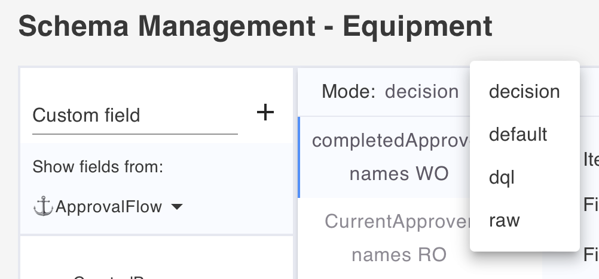

# Lab 03 - Schema exploration

## Duration 30 min

## What you will learn:

- What's a form mode
- What's a field group
- Formulas to control access

## Prerequisites

- Lab 02 completed
- Domino running

## Steps

Before you start altering the schema, use **Postman**, as outlined in _How to check_ to observe the API behavior before and after.

1. In Admin UI, edit the `default` schema of `ApprovalsCentral.nsf`, and select the Equipment form.
2. In mode `default`, add the following fields to a `field group` named *stuff*.

    - childRN
    - Comments
    - Cost
    - Equipment

3. Add new modes: dql, (needs fields), raw (doesn't need fields).
4. Add a new mode `decision` with 4 fields:

    | Name              |  Type  |   Access   |
    | ----------------- | :----: | :--------: |
    | completedApprover | names  | write-only |
    | newHistory        | string | write-only |
    | Status            | string | read-only  |
    | CurrentApprover   | names  | read-only  |

  Check the box "compute with form"

  {: style="height:80%;width:80%"}

  {: style="height:80%;width:80%"}

  Don't forget to save your changes.

## How to check

- Use Postman to retrieve document using default mode before and after your changes.
- Try to use the "/raw" endpoint before and after creating the "raw" mode.
- Try a dql query before and after the dql mode was created.
- Observe the difference before / after the addition of field groups.

## Things to explore

- [Official Domino REST API documentation](https://opensource.hcltechsw.com/Domino-rest-api/index.html)
- [Discord discussion](https://discord.com/invite/jmRHpDRnH4)
- Change the formula for read/write access to exclude your default user, observe the API reaction in Postman.
- Try the "Test Formula" button in mode.
- Change the write access for default to `Status = "" | Status = "draft"`.
- Observe the difference when "compute with form" is checked.
- Modify a field Name, do you see the output changing?
