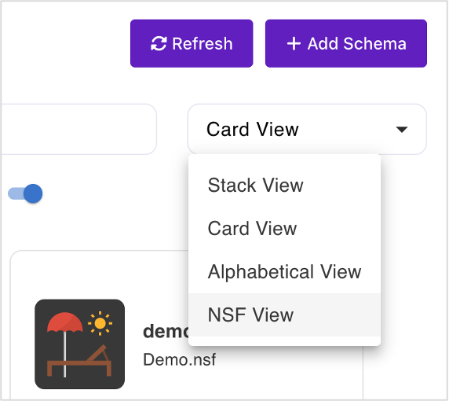
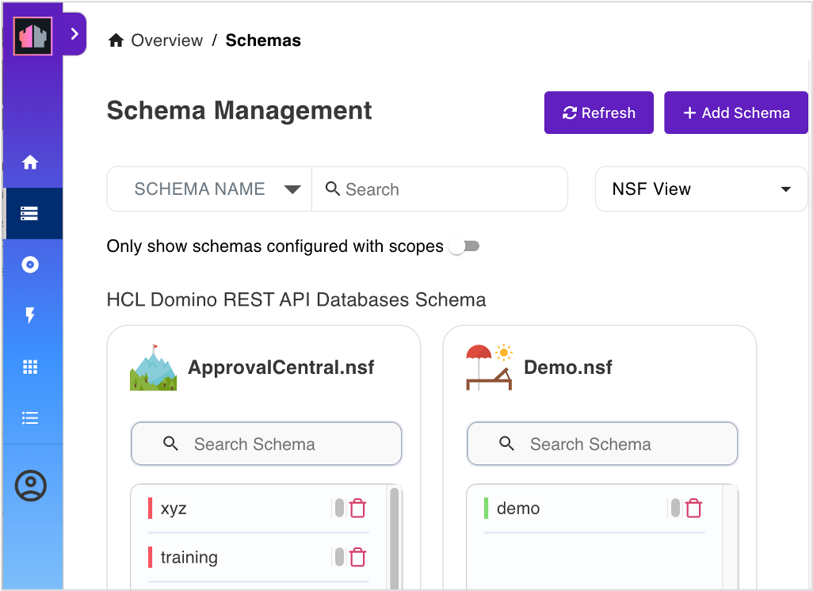

# Lab 04 - Additional scope & schema

## What you will learn

How to expose different sets of information from a database using different schemas.

## Before your begin

- You have completed [Lab 03 - Schema exploration](lab-03.md).
- Your Domino server must be running.
- Postman is available.

## Procedure

### Create schema

1. In the **Admin UI**, select **Database Management - REST API** or click **Schemas** from the navigation pane.
2. On the **Schema Management** page, click **Add Schema**.
3. Select `ApprovalCentral.nsf` from the **Database**.
4. Fill in the **Schema Name** with `training` and the other fields as shown.

    
5. Click **Add**.
6. On the **Schema Management** page, switch the page view to **NSF View**.

    

    

7. Click the `training` schema to edit.
8. Under the **Database Forms**, configure only the form `Training`.

    | Field    |  Type  |   Access   |
    | -------- | :----: | :--------: |
    | Form     | string | read-write |
    | from     | names  | read-write |
    | Training | string | read-write |

9. Set the **Formula for Write Access** to `@false`

10. Click **Save**.
11. Go to **Databse Views**, and then activate views `(TrainingApprovals)` and `(PendingApprovals)`.

### Create scope

1. Click **Scopes** from the navigation pane.
2. Click **Add Scope** on the **Scope Management** page.
3. Select the schema `training` under the `ApprovalCentral.nsf` from the **Available Schema**.
4. Fill in the **Scope Name** as `trainingcorp`, and enter details in the **Description**.
  
    Leave the **Server** and **Maximum Level Access** as they are.

5. Click **Add**. The new scope is added to your scopes list.

    

Alternatively, you can use `POST` to `/api/setup-v1/admin/scope`

```json
{
  "apiName": "trainingcorp",
  "createSchema": false,
  "description": "Subset Training for XY Training Inc",
  "iconName": "handshake",
  "isActive": true,
  "nsfPath": "ApprovalCentral.nsf",
  "schemaName": "training",
  "server": "*"
}
```

## How to verify

- Retrieve the list of schemas for `ApprovalCentral.nsf`.
- Retrieve the list of scopes.
- Check the **Admin UI**.
- Login with limit to scope `trainingcorp` and look at data in Postman.

## Next step

Proceed to [Lab 05 - Create an application](lab-05.md).

<!--
Rationale: An external training provider shall get access to Name and Course, but neither cost nor approval flows.

## Duration 10 min

## What you will learn:

A database can expose different sets of information based on different schema.

## Prerequisites

- Lab 03 completed
- Domino running
- Postman available

## Steps for schema and scope exploration

### Create schema

1. In the Admin UI, select "Database Management - REST API"
2. Click **Schemas** from the navigation pane.
3. On the **Schema Management**, click **Add Schema**".
4. Select `ApprovalCentral.nsf` from the **Available Databases**.
5. Fill in Schema Name: `training`

    

6. Switch to the "NSF View"

    

    

7. Click to edit the `training` schema.
8. Under the **Database Forms**, configure only  the form `Training`.

    | Field    |  Type  |   Access   |
    | -------- | :----: | :--------: |
    | Form     | string | read-write |
    | from     | names  | read-write |
    | Training | string | read-write |

    Set formula for write access to `@false`

    !!! warning "Important" 
        Don't forget to save.

9. On the **Databse Views**, the view `(TrainingApprovals)`, and `PendingApprovals` must set to `active`.

### Create scope

1. Click **Scopes** from the navigation pane.
2. Click **Add Scope**, on the **Scope Management**
3. Select the schema `training` from the `ApprovalCentral.nsf` from  the **Available Schema**
4. Fill in **Scope Name** as `trainingcorp`. Fill the **Description**.
  
    Leave the **Server** and **Maximum Level Access** as they are. 

5. Click **Add**. It will be added to your scopes list.

    

Alternative `POST` to `/api/setup-v1/admin/scope`

```json
{
  "apiName": "trainingcorp",
  "createSchema": false,
  "description": "Subset Training for XY Training Inc",
  "iconName": "handshake",
  "isActive": true,
  "nsfPath": "ApprovalCentral.nsf",
  "schemaName": "training",
  "server": "*"
}
```

## How to check

- Retrieve list of schemas for `ApprovalCentral.nsf`.
- Retrieve list of scopes.
- Check Admin UI.
- Login with limit to scope `trainingcorp` and look at data in POSTMAN.

## Things to explore

- [Domino REST API documentation](https://opensource.hcltechsw.com/Domino-rest-api/index.html)

- [Discord discussion](https://discord.com/invite/jmRHpDRnH4)
- Login with a limited scope and try to access the other scope's data.
-->