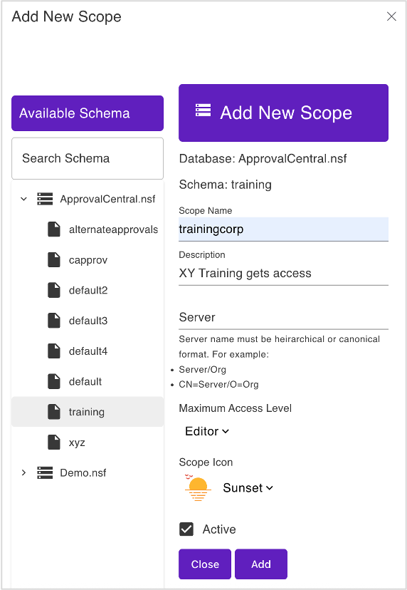

# Lab 04 - Additional scope & schema

Rationale: An external training provider shall get access to Name and Course,
but neither cost nor approval flows

## Duration 10 min

## What you will learn

- a database can expose different sets of information based on different schema

## Prerequisites

- Lab 03 completed
- Domino running
- Postman available

## Steps

### Create schema training

- In the AdminUI select "Database Management - REST API"
- Click "Add Schema"
- Pick `ApprovalCentral.nsf`
- Schema Name: `training`

  

- Switch to the "NSF View"

  

  

- Edit the training schema
- Configure only form `Training`

  | Field    |  Type  |   Access   |
  | -------- | :----: | :--------: |
  | Form     | string | read-write |
  | from     | names  | read-write |
  | Training | string | read-write |

  Set formula for write access to `@false`

- Configure view `(TrainingApprovals)`

!!! danger "Don't forget to save"

### Create scope trainingcorp



alternative `POST` to `/api/setup-v1/admin/scope`

```json
{
  "apiName": "trainingcorp",
  "createSchema": false,
  "description": "Subset Training for XY Training Inc",
  "iconName": "handshake",
  "isActive": true,
  "nsfPath": "ApprovalCentral.nsf",
  "schemaName": "training",
  "server": "*"
}
```

## How to check

- retrive list of schemas for ApprovalCentral.nsf
- retrive list of scopes
- check adminUI
- Login with limit to scope `trainingcorp` and look at data in POSTMAN

## Things to explore

- [Official Domino REST API documentation](https://opensource.hcltechsw.com/Domino-rest-api/index.html)
- [Discord discussion](https://discord.com/invite/jmRHpDRnH4)
- Login with a limited scope and try to access the other scope's data
