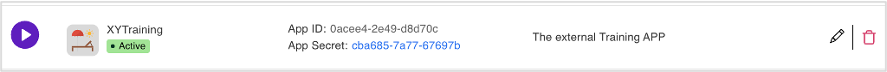

# Lab 05 - Create an application

!!! tip

    An *Application* is the configuration you need when you want to use Domino's built-in Identity Provider (IdP) functionality. IdP is part of the **OAuth**-based Identity standard.

## What you will learn

How to configure credentials for an app to log in *on your behalf* with a limited set of permissions.

## Before you begin

- You have completed [Lab 04 - Additional scope & schema](lab-04.md).
- Your Domino server must be running.

## Procedure

### Create an app

1. In the **Admin UI**, select **Application Management - OAUTH** or click **Applications** from the navigation pane.
2. On the **Application Management**, click **Add Application**.
3. Fill in the fields as shown in the following image.

    

    - The callback URLs must be provided by the developer or the admin, and need to match.
    - Add scopes as desired.

    !!! note "Scopes need to exist"

        You can specify one or more scopes that do not currently exist. However, ensure these scopes are created before using the application.

4. Click **Add**. The app is saved in the app list.

Alternatively, you can use `POST` to `/api/setup-v1/admin/application`

```json
{
  "client_name": "XYTraining",
  "description": "The external Training APP",
  "redirect_uris": ["http://localhost:3000/auth/callback"],
  "client_uri": "https://www.spiegel.de",
  "scope": "trainingcorp",
  "logo_uri": "cathedral",
  "status": "isActive",
  "contacts": ["Doctor.Notes@projectkeep.io"]
}
```

### Generate app secret

- Click **Click to Generate Secret**.

    

    The generated secret is shown on the app.

    

    !!! note

        Write or note the App Secret and App Id.


Alternatively, you can use `POST` to `/api/setup-v1/admin/application/{{CLIENT_ID}}/secret?force=true`

```json
{
  "client_id": "{{CLIENT_ID}}",
  "status": "isActive"
}
```

!!! warning "App Secrets can't be retrieved"

    Once you leave the app screen where the App Secret is displayed, the generated secret is no longer accessible, as it is securely stored using salted hashing, preventing it from being transformed back to its original form.

## How to verify

- The app appears in the Admin UI.
- The app appears in the Domino REST API landing screen.

## Things to explore

- [Domino REST API documentation](https://opensource.hcltechsw.com/Domino-rest-api/index.html)

- [Discord discussion](https://discord.com/invite/jmRHpDRnH4)

- Explore creating and retrieving an app in Postman.
- Reset the secret.
- Do the OAuth dance in Postman.

## Next step

Proceed to [Lab 06 - Create a NodeJS application](lab-06.md).

<!--
Rationale: "Application" is the configuration you need when you want to use Domino's build in Identity Provider (IdP) functionality. IdP is part of the **OAuth** based Identity standard

## Duration 10 min

## What you will learn

Configure credentials, so an application can login _on your behalf_ with a limited set of permissions. Needed for lab 6.

## Prerequisites

- Lab 04 completed
- Domino running

## Steps in  creating app in Admin UI

1. Go to **Application** navigation pane and click **Add Application**.
2. Fill in the fields according to below image.

    

    - The callback URLs need to be provided by the application developer/admin and need to match
    - Add scopes as desired

    !!! note "Scopes need to exist"
        
        You can specify one or more scopes that don't exist (yet). Just make sure they do once the application shall be used.

3. Click **Add**. The app save in the app list.

Alternative `POST` to `/api/setup-v1/admin/application`

```json
{
  "client_name": "XYTraining",
  "description": "The external Training APP",
  "redirect_uris": ["http://localhost:3000/auth/callback"],
  "client_uri": "https://www.spiegel.de",
  "scope": "trainingcorp",
  "logo_uri": "cathedral",
  "status": "isActive",
  "contacts": ["Doctor.Notes@projectkeep.io"]
}
```

### Generate Application Secret

1. Click **Click to Generate Secret**. 

    


2. The generated secret will be shown on the app.

    

    !!!note
        Write or note the App Secret and App Id.


Alternative `POST` to `/api/setup-v1/admin/application/{{CLIENT_ID}}/secret?force=true`

```json
{
  "client_id": "{{CLIENT_ID}}",
  "status": "isActive"
}
```

!!! warning "App Secrets can't be retrieved"

    Once you switch away from the App screen where you saw the "App Secret", it is gone. We store and save it salted and hashed and can't transform it back

## How to check

- App shows up in Admin UI.
- App shows up in landing screen.

## Things to explore

- [Domino REST API documentation](https://opensource.hcltechsw.com/Domino-rest-api/index.html)

- [Discord discussion](https://discord.com/invite/jmRHpDRnH4)

- Explore creating / retrieving app in Postman.
- Reset the secret.
- Do the OAuth dance in Postman.
-->