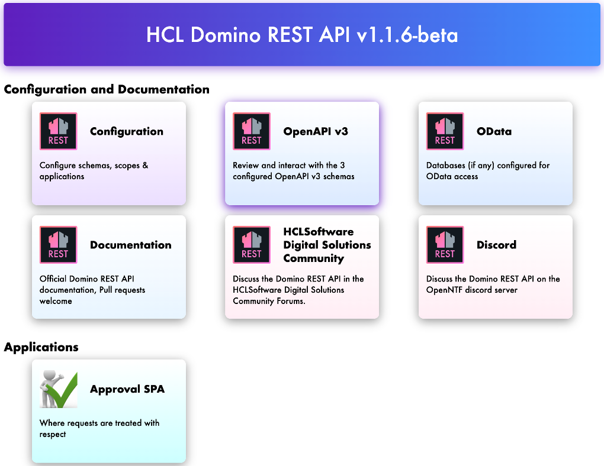

# Lab 07 - Create a SPA

## Duration 20 min

## What you will learn

You can create a browser single page application using just 3 files

## Prerequisites

- Lab 05 completed
- Domino running
- Internet connection

## Steps

- Create a new directory `[notesdata]/keepweb.d/approvalspa`
- Download [SPA-source.zip](../downloads/SPA-source.zip)
- Unzip the content into `approvalspa`
- Reload the landing page

## How to check

- Application should work
- Application shows up on landing page

## Things to explore

- [Official Domino REST API documentation](https://opensource.hcltechsw.com/Domino-rest-api/index.html)
- [Discord discussion](https://discord.com/invite/jmRHpDRnH4)
- Create a new directory in `keepweb.d` and a `manifest.json` file. Check out the landing page.
- Check the application source code (5 files only).
