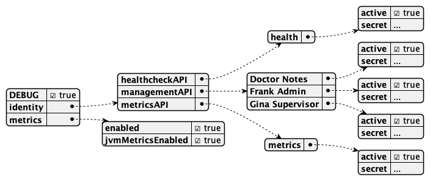

# Lab 9 - Unlock additional ports

## Duration 20 min

## What you will learn

- Learn about metrics, healthcheck & management
- Configure the functional accounts

## Prerequisites

- Domino running

## Steps

{: style="height:80%;width:80%"}

- Create a JSON file in `keepconfig.d` with any name, such as `portmagic.json`.
- Add the content like below:

!!! danger "[supersecret] isn't a good password"

    You have to promise never to use that in production or externally reachable servers:

    `FA1D8FC7DAA715F20A3C19F62451DCD011483EFBABE46A1C03F2CF0702365726:0A2AC2338974379073BEF880B2EA9E4FE86651974C83D3958DB73C81047CF3815456678A3EE206975CE17B7874589478A2FC92DCDF2C1794087AED94BF8FD4CA`

```json
{
  "DEBUG": true,
  "identity": {
    "healthcheckAPI": {
      "health": {
        "active": true,
        "secret": "FA1D8FC7DAA715F20A3C19F62451DCD011483EFBABE46A1C03F2CF0702365726:0A2AC2338974379073BEF880B2EA9E4FE86651974C83D3958DB73C81047CF3815456678A3EE206975CE17B7874589478A2FC92DCDF2C1794087AED94BF8FD4CA"
      }
    },
    "managementAPI": {
      "Doctor Notes": {
        "active": true,
        "secret": "FA1D8FC7DAA715F20A3C19F62451DCD011483EFBABE46A1C03F2CF0702365726:0A2AC2338974379073BEF880B2EA9E4FE86651974C83D3958DB73C81047CF3815456678A3EE206975CE17B7874589478A2FC92DCDF2C1794087AED94BF8FD4CA"
      }
    },
    "metricsAPI": {
      "metrics": {
        "active": true,
        "secret": "FA1D8FC7DAA715F20A3C19F62451DCD011483EFBABE46A1C03F2CF0702365726:0A2AC2338974379073BEF880B2EA9E4FE86651974C83D3958DB73C81047CF3815456678A3EE206975CE17B7874589478A2FC92DCDF2C1794087AED94BF8FD4CA"
      }
    }
  },
  "metrics": {
    "enabled": true,
    "jvmMetricsEnabled": true
  }
}
```

- Restart the restapi.



## How to check

Navigate to the new URLs, you should be prompted with basic auth. Password is `supersecret` and user is the respective key from the JSON file.


- Healthcheck: [http://localhost:8886/health](http://localhost:8886/health)

- Metrics: [http://localhost:8890/metrics](http://localhost:8890/metrics)

- Management UI: [http://localhost:8889/](http://localhost:8889/)

## Things to explore

- [Official Domino REST API documentation](https://opensource.hcltechsw.com/Domino-rest-api/index.html)

- [Discord discussion](https://discord.com/invite/jmRHpDRnH4)
