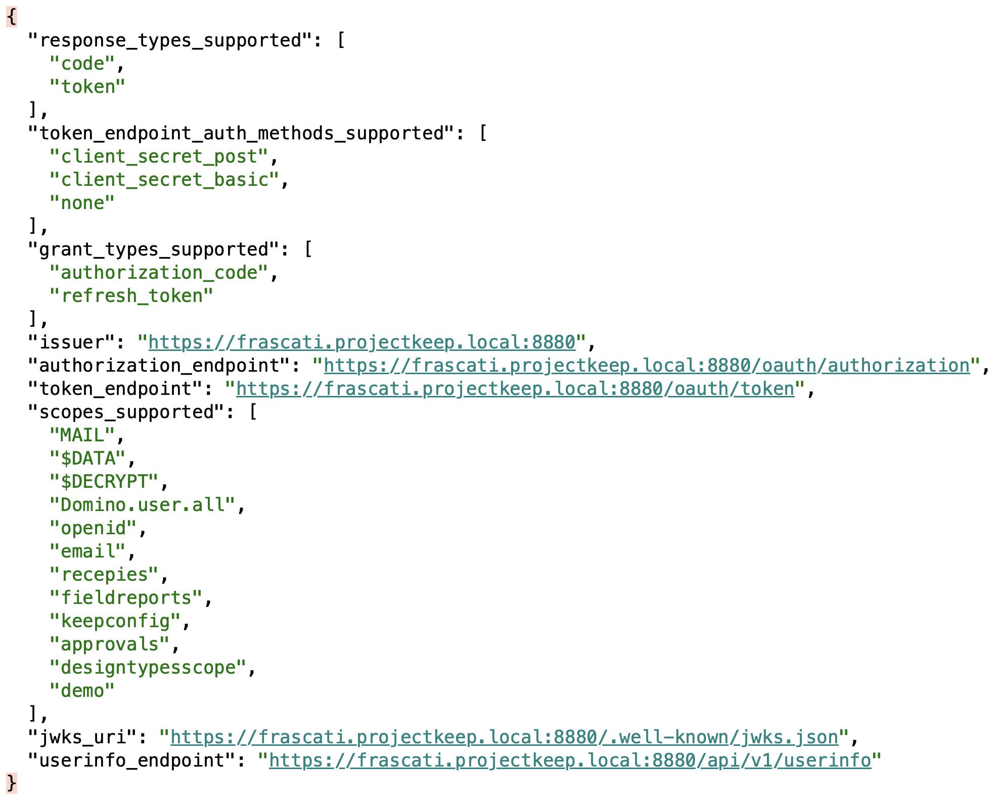
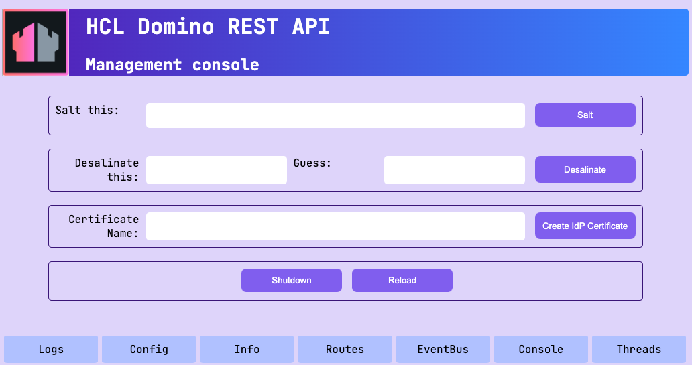

# Lab 10 - Configure JWT

By default, the Domino REST API uses a random symmetric JWT signing key that’s changed each time the API service restarts. This approach works fine for testing and single-server use. However, it's not suitable for multi-server operation or for IdP use.

## What you will learn

- Understanding how Domino REST API configuration works.
- Additional endpoints other than port 8880
- How to use the Management console. 

## Before you begin

Your Domino server must be running.

## Procedure

1. Access [http://localhost:8889](http://localhost:8889).

    {: style="height:70%;width:70%"}

2. Enter a name in the **Certificate Name** field, and click **Create IdP Certificate**.

    !!! note

        The entered name should have no spaces or special characters.

3. Restart Domino REST API.

## How to verify

- Check the `keepconfig.d` directory. You should see new files matching the entered certificate name.

    For example, if you entered `KeepLabIdP` as your certificate name, you should see the following files in `keepconfig.d`:
    
    - `KeepLabIdP.json`
    - `KeepLabIdP.cert.pem`
    - `KeepLabIdP.private.key.pem`
    - `KeepLabIdP.public.key.pem`

- After restarting Domino REST API, the JWT provider changes. For more information, see [Log in to the REST API](lab-01.md).

When you copy these files to another server, the JWT issued by the first server will be recognized and accepted by the second server as well. This extends to the Domino HTTP task if the core Domino is configured for JWT.

Check [`http://localhost:8880/.well-known/openid-configuration`](http://localhost:8880/.well-known/openid-configuration).

{: style="height:70%;width:70%"}

## Things to explore

- [Domino REST API documentation](https://opensource.hcltechsw.com/Domino-rest-api/index.html)

- [Discord discussion](https://discord.com/invite/jmRHpDRnH4)

- Copy the generated files to another server and try cross login.

## Next step

Proceed to [Lab 11 - Domino REST API Configuration](lab-11.md).

<!--

Out of the box KEEP uses a random symmetrical JWT signing key, that's changed on any reboot of the API. This is OK for test and single server use, but not for multi-server operation or use as IdP.

## Duration 20 min

## What you will learn

- How KEEP configuration works
- Additional endpoints beyond 8880
- Use the management UI

## Prerequisites

- Domino running

## Steps

- Access [http://localhost:8889](http://localhost:8889)

- Fill in **Certificate Name**, and click **Create IdP Certificate**.
- Restart Domino REST API. 

## How to check

- New files in `keepconfig.d`, such as when you filled in `KeepLabIdP` as Certificate Name, you end up with:
    - `KeepLabIdP.json`
    - `KeepLabIdP.cert.pem`
    - `KeepLabIdP.private.key.pem`
    - `KeepLabIdP.public.key.pem`
- on restart keep: JWT provider changes (see login in KEEP).

When you copy these files to another server, the JWT issued by the first server will be accepted by the second server as well. This extends to the Domino HTTP task if core Domino is configured for JWT.

Check [`http://localhost:8880/.well-known/openid-configuration`](http://localhost:8880/.well-known/openid-configuration).

## Things to explore

- [Domino REST API documentation](https://opensource.hcltechsw.com/Domino-rest-api/index.html)

- [Discord discussion](https://discord.com/invite/jmRHpDRnH4)

- Copy files generated to another server and try cross login.
-->