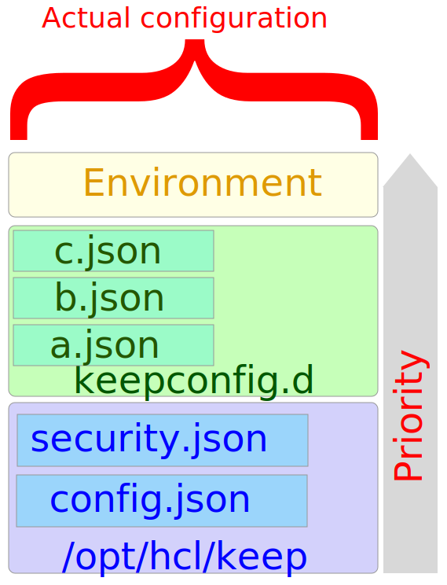
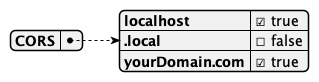
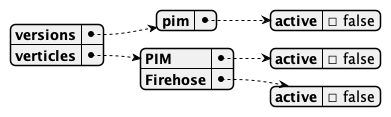
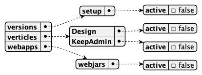
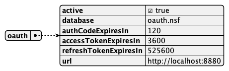

# Lab 11 - KEEP Configuration

The Domino REST API provides extensive configuration capabilities to cater to different usage scenarios

## Duration 20 min

## What you will learn

- Fine tune KEEP configuration
- Switch on/off API endpoints

{: style="height:80%;width:80%"}

## Prerequisites

- Domino running

## Steps

All configuration settings are kept in JSON files you place in `keepcofig.d`. Files are loaded in alphabetical order. When you have conflicting entries, the last one wins. After a change the REST API needs to be reloaded.

### Update CORS settings

```json
{
  "CORS": {
    "localhost": true,
    ".local": false,
    "yourDomain.com": true
  }
}
```



**Starting Domino REST API v1.1.3**, CORS uses Regex. For more information, see [CORS is now using Regex](../../whatsnew/v1.1.3.md#cors-is-now-using-regex).

```json
{
  "CORS": {
    "^https?:\\/\\/localhost$": true,
    "^https?:\\/\\/.*\\.local$": false,
    "^https?:\\/\\/yourDomain\\.com$": true
  }
}
```

wherein:

- `^` &rarr; beginning of the string
- `http` &rarr; the literal string `http`
- `s?` &rarr; optional the string `s`
- `\\/` &rarr; double escape the string `/`
- `.*` &rarr; one or more characters of any type
- `\\.` &rarr; double escape the string `.`
- `$` &rarr; end of string

!!! note

    Inside JSON, the `\` of Regex gets escaped to `\\`.

### Disable PIM access

```json
{
  "versions": {
    "pim": {
      "active": true
    }
  },
  "verticles": {
    "PIM": {
      "active": false
    },
    "Firehose": {
      "active": false
    }
  }
}
```



### Disable Admin Endpoints and UI

```json
{
  "versions": {
    "setup": {
      "active": false
    }
  },
  "verticles": {
    "Design": {
      "active": false
    },
    "KeepAdmin": {
      "active": false
    }
  },
  "webapps": {
    "webjars": {
      "active": false
    }
  }
}
```



### Enable OAuth

```json
{
  "oauth": {
    "active": true,
    "database": "oauth.nsf",
    "authCodeExpiresIn": 120,
    "accessTokenExpiresIn": 3600,
    "refreshTokenExpiresIn": 525600,
    "url": "http://localhost:8880"
  }
}
```



## How to check

- check with swagger
- check with curl

## Things to explore

- [Official Domino REST API documentation](https://opensource.hcltechsw.com/Domino-rest-api/index.html)

- [Discord discussion](https://discord.com/invite/jmRHpDRnH4)

- Mess with other parameters:
    - disable Domino login
    - enable Preview features
    - update NsfExclusions
